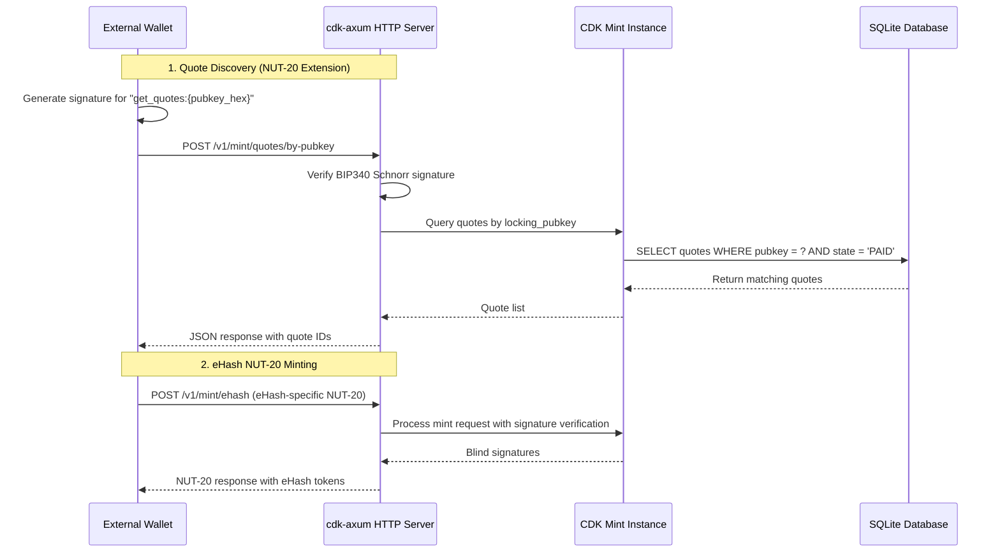
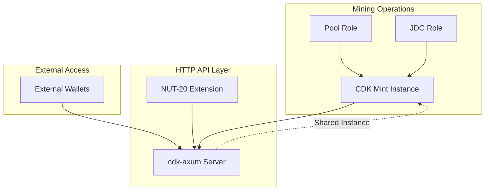

# Design Document - eHash HTTP API

## Overview

This design implements HTTP API access for the eHash mint system by extending cdk-axum with NUT-20 authenticated quote discovery. The system leverages the existing CDK Mint instance and adds a single new endpoint for wallets to securely discover their PAID quotes using signature authentication.

## Architecture

### High-Level Component Interaction



### System Integration

The HTTP API integrates with existing eHash components without disrupting mining operations:



## Components and Interfaces

### 1. NUT-20 Extension Implementation

The core extension adds authenticated quote discovery to cdk-axum:

```rust
// New module: cdk-axum/src/nut20_extension.rs

use axum::{extract::State, http::StatusCode, Json};
use bitcoin::secp256k1::{PublicKey, Signature, Message, Secp256k1};
use bitcoin::hashes::{sha256, Hash};
use cdk::Mint;
use cdk::nuts::{BlindedMessage, BlindSignature, MintQuoteState};
use std::sync::Arc;

#[derive(Deserialize)]
pub struct QuotesByPubkeyRequest {
    /// Compressed secp256k1 public key (33 bytes, hex-encoded) or hpub format
    pub pubkey: String,
    /// BIP340 Schnorr signature on "get_quotes:{pubkey_hex}" message
    pub signature: String,
}

#[derive(Serialize)]
pub struct QuotesByPubkeyResponse {
    /// List of PAID quotes for the authenticated public key
    pub quotes: Vec<EHashQuoteSummary>,
}

#[derive(Serialize)]
pub struct EHashQuoteSummary {
    /// Quote identifier
    pub quote: String,
    /// Quote state (should be "PAID" for discoverable quotes)
    pub state: MintQuoteState,
    /// Quote expiry timestamp
    pub expiry: u64,
    /// Amount in the quote's currency unit
    pub amount: u64,
    /// Currency unit (e.g., "HASH", "sat")
    pub unit: String,
    /// Public key associated with this quote (for verification)
    pub pubkey: Option<String>,
}

/// NUT-20 Extension: Query quotes by public key with signature authentication
pub async fn get_quotes_by_pubkey(
    State(mint): State<Arc<Mint>>,
    Json(req): Json<QuotesByPubkeyRequest>,
) -> Result<Json<QuotesByPubkeyResponse>, StatusCode> {
    // 1. Parse public key (support both hex and hpub formats)
    let pubkey = parse_pubkey(&req.pubkey)
        .map_err(|_| StatusCode::BAD_REQUEST)?;

    // 2. Parse signature
    let signature = Signature::from_str(&req.signature)
        .map_err(|_| StatusCode::BAD_REQUEST)?;

    // 3. Verify signature using NUT-20 signature scheme (BIP340 Schnorr)
    let message = format!("get_quotes:{}", hex::encode(pubkey.serialize()));
    let message_hash = Message::from_hashed_data::<sha256::Hash>(message.as_bytes());
    
    let secp = Secp256k1::verification_only();
    secp.verify_schnorr(&signature, &message_hash, &pubkey.x_only_public_key().0)
        .map_err(|_| StatusCode::UNAUTHORIZED)?;

    // 4. Query CDK Mint for quotes with matching locking_pubkey
    let quotes = mint.get_quotes_by_pubkey(&pubkey).await
        .map_err(|_| StatusCode::INTERNAL_SERVER_ERROR)?;

    // 5. Filter to PAID quotes only and convert to eHash response format
    let quote_summaries: Vec<EHashQuoteSummary> = quotes
        .into_iter()
        .filter(|q| q.state == MintQuoteState::Paid)
        .map(|q| EHashQuoteSummary {
            quote: q.id.to_string(),
            state: q.state,
            expiry: q.expiry,
            amount: q.amount.unwrap_or(Amount::ZERO).into(),
            unit: q.unit.to_string(),
            pubkey: q.pubkey.map(|pk| pk.to_string()),
        })
        .collect();

    Ok(Json(QuotesByPubkeyResponse {
        quotes: quote_summaries,
    }))
}

/// eHash-specific NUT-20 minting endpoint
pub async fn mint_ehash_tokens(
    State(mint): State<Arc<Mint>>,
    Json(req): Json<PostMintEHashRequest>,
) -> Result<Json<PostMintEHashResponse>, StatusCode> {
    // 1. Verify quote exists and is PAID
    let quote = mint.get_mint_quote(&req.quote_id).await
        .map_err(|_| StatusCode::NOT_FOUND)?
        .ok_or(StatusCode::NOT_FOUND)?;
    
    if quote.state != MintQuoteState::Paid {
        return Err(StatusCode::BAD_REQUEST);
    }
    
    // 2. Verify NUT-20 signature (same as standard NUT-20)
    if let Some(quote_pubkey) = &quote.pubkey {
        let signature = req.signature.ok_or(StatusCode::BAD_REQUEST)?;
        verify_nut20_signature(&req.quote_id, &req.outputs, &signature, quote_pubkey)
            .map_err(|_| StatusCode::UNAUTHORIZED)?;
    }
    
    // 3. Process minting (standard CDK flow)
    let signatures = mint.process_mint_request(&req.quote, &req.outputs).await
        .map_err(|_| StatusCode::INTERNAL_SERVER_ERROR)?;
    
    Ok(Json(PostMintEHashResponse { signatures }))
}

#[derive(Deserialize)]
pub struct PostMintEHashRequest {
    /// Quote ID from previous quote discovery
    pub quote: String,
    /// Blinded messages for token creation
    pub outputs: Vec<BlindedMessage>,
    /// NUT-20 signature (required for eHash quotes)
    pub signature: Option<String>,
}

#[derive(Serialize)]
pub struct PostMintEHashResponse {
    /// Blind signatures for the requested outputs
    pub signatures: Vec<BlindSignature>,
}

/// Parse public key from hex or hpub format
fn parse_pubkey(pubkey_str: &str) -> Result<PublicKey, Box<dyn std::error::Error>> {
    if pubkey_str.starts_with("hpub") {
        // Parse hpub format (bech32 with 'hpub' prefix)
        ehash_integration::hpub::parse_hpub(pubkey_str)
    } else {
        // Parse hex format
        let bytes = hex::decode(pubkey_str)?;
        PublicKey::from_slice(&bytes).map_err(Into::into)
    }
}

/// Verify NUT-20 signature for eHash minting (reuse CDK's NUT-20 verification logic)
fn verify_nut20_signature(
    quote_id: &str,
    outputs: &[BlindedMessage],
    signature: &str,
    pubkey: &PublicKey,
) -> Result<(), Box<dyn std::error::Error>> {
    // Use CDK's existing NUT-20 signature verification
    // This should delegate to CDK's implementation to avoid code duplication
    cdk::nuts::verify_nut20_signature(quote_id, outputs, signature, pubkey)
}
```

### 2. CDK Mint Extension for Pubkey Queries

Extend the CDK Mint to support querying quotes by public key:

```rust
// Extension to CDK Mint implementation

impl Mint {
    /// Query mint quotes by locking public key
    /// This method needs to be added to CDK Mint
    pub async fn get_quotes_by_pubkey(
        &self,
        pubkey: &PublicKey,
    ) -> Result<Vec<MintQuote>, cdk::Error> {
        // Query the database for quotes where locking_pubkey matches
        // This requires access to the quote storage and filtering by pubkey
        
        let all_quotes = self.localstore.get_mint_quotes().await?;
        
        let matching_quotes: Vec<MintQuote> = all_quotes
            .into_iter()
            .filter(|quote| {
                // Check if quote has locking_pubkey that matches
                if let Some(quote_pubkey) = &quote.pubkey {
                    quote_pubkey == pubkey
                } else {
                    false
                }
            })
            .collect();
            
        Ok(matching_quotes)
    }
}
```

### 3. Router Integration

Integrate the new endpoint into cdk-axum's router:

```rust
// Modification to cdk-axum/src/router.rs

use crate::nut20_extension::get_quotes_by_pubkey;

pub fn mint_router(mint: Arc<Mint>) -> Router {
    Router::new()
        // Standard cdk-axum endpoints (unchanged)
        .route("/v1/info", get(info))
        .route("/v1/keys", get(keys))
        .route("/v1/keys/:keyset_id", get(keyset))
        .route("/v1/mint/quote/bolt11/:quote_id", get(check_quote))
        .route("/v1/mint/bolt11", post(mint_tokens))
        
        // eHash-specific endpoints
        .route("/v1/mint/ehash", post(mint_ehash_tokens))  // eHash NUT-20 minting
        .route("/v1/mint/quotes/by-pubkey", post(get_quotes_by_pubkey))  // Quote discovery
        
        .with_state(mint)
}
```

### 4. HTTP Server Integration in Pool/JDC

Add HTTP server spawning to Pool and JDC roles:

```rust
// Integration in Pool role (roles/pool/src/lib/mod.rs)

use cdk_axum;
use tokio::net::TcpListener;

pub struct PoolConfig {
    // Existing fields...
    pub http_api: Option<HttpApiConfig>,
}

#[derive(Debug, Deserialize)]
pub struct HttpApiConfig {
    pub enabled: bool,
    pub bind_address: String,  // e.g., "127.0.0.1:3338"
    pub tls_cert_path: Option<String>,
    pub tls_key_path: Option<String>,
}

impl Pool {
    pub async fn start_http_server(
        mint: Arc<Mint>,
        config: HttpApiConfig,
    ) -> Result<(), PoolError> {
        if !config.enabled {
            return Ok(());
        }

        let app = cdk_axum::mint_router(mint);
        let listener = TcpListener::bind(&config.bind_address).await?;
        
        info!("Starting eHash HTTP API on {}", config.bind_address);
        
        // Spawn HTTP server in background task
        tokio::spawn(async move {
            if let Err(e) = axum::serve(listener, app).await {
                error!("HTTP server error: {}", e);
            }
        });

        Ok(())
    }
}

// Similar integration for JDC role when in Mint mode
```

## Data Models

### Request/Response Formats

#### eHash Minting Request (POST /v1/mint/ehash)
```json
{
  "quote": "9d745270-1405-46de-b5c5-e2762b4f5e00",
  "outputs": [
    {
      "amount": 1024,
      "id": "009a1f293253e41e", 
      "B_": "035015e6d7ade60ba8426cefaf1832bbd27257636e44a76b922d78e79b47cb689d"
    }
  ],
  "signature": "d9be080b33179387e504bb6991ea41ae0dd715e28b01ce9f63d57198a095bccc776874914288e6989e97ac9d255ac667c205fa8d90a211184b417b4ffdd24092"
}
```

#### eHash Minting Response
```json
{
  "signatures": [
    {
      "id": "009a1f293253e41e",
      "amount": 1024,
      "C_": "0224f1c4c564230ad3d96c5033efdc425582397a5a7691d600202732edc6d4b1ec"
    }
  ]
}
```

#### Quote Discovery Request
```json
{
  "pubkey": "03d56ce4e446a85bbdaa547b4ec2b073d40ff802831352b8272b7dd7a4de5a7cac",
  "signature": "d9be080b33179387e504bb6991ea41ae0dd715e28b01ce9f63d57198a095bccc776874914288e6989e97ac9d255ac667c205fa8d90a211184b417b4ffdd24092"
}
```

Alternative with hpub format:
```json
{
  "pubkey": "hpub1qw508d6qejxtdg4y5r3zarvary0c5xw7k...",
  "signature": "d9be080b33179387e504bb6991ea41ae0dd715e28b01ce9f63d57198a095bccc776874914288e6989e97ac9d255ac667c205fa8d90a211184b417b4ffdd24092"
}
```

#### Quote Discovery Response
```json
{
  "quotes": [
    {
      "quote": "9d745270-1405-46de-b5c5-e2762b4f5e00",
      "state": "PAID",
      "expiry": 1701704757,
      "amount": 1024,
      "unit": "HASH",
      "pubkey": "03d56ce4e446a85bbdaa547b4ec2b073d40ff802831352b8272b7dd7a4de5a7cac"
    },
    {
      "quote": "7c8a3b91-2f45-4d8e-a123-456789abcdef", 
      "state": "PAID",
      "expiry": 1701704890,
      "amount": 512,
      "unit": "HASH",
      "pubkey": "03d56ce4e446a85bbdaa547b4ec2b073d40ff802831352b8272b7dd7a4de5a7cac"
    }
  ]
}
```

#### Error Responses
```json
// 400 Bad Request - Invalid pubkey or signature format
{
  "error": "Invalid public key format",
  "code": 400
}

// 401 Unauthorized - Invalid signature
{
  "error": "Invalid signature for public key",
  "code": 401
}

// 500 Internal Server Error - Database/CDK error
{
  "error": "Internal server error",
  "code": 500
}
```

### Configuration Models

#### Pool Configuration Extension
```toml
# roles/pool/config-examples/pool-config-with-http-api.toml

[ehash_mint]
# Existing mint configuration...
mint_url = "https://mint.example.com"
database_url = "sqlite://pool_mint.db"
min_leading_zeros = 32

# HTTP API configuration
[ehash_mint.http_api]
enabled = true
bind_address = "127.0.0.1:3338"
tls_cert_path = "/path/to/cert.pem"  # Optional
tls_key_path = "/path/to/key.pem"    # Optional
```

#### JDC Configuration Extension
```toml
# roles/jd-client/config-examples/jdc-config-mint-with-http-api.toml

[ehash_config]
mode = "mint"

[ehash_config.mint]
# Existing mint configuration...
mint_url = "https://mint.example.com"
database_url = "sqlite://jdc_mint.db"
min_leading_zeros = 32

# HTTP API configuration
[ehash_config.mint.http_api]
enabled = true
bind_address = "127.0.0.1:3339"
```

## Security Model

### Signature Authentication Flow

The NUT-20 extension uses the same signature scheme as standard NUT-20:

1. **Message Construction**: `"get_quotes:{pubkey_hex}"` where `pubkey_hex` is the compressed secp256k1 public key in hex format
2. **Signature Generation**: BIP340 Schnorr signature on SHA-256 hash of the message
3. **Signature Verification**: Server verifies signature matches the provided public key
4. **Authorization**: Only return quotes where `quote.pubkey == authenticated_pubkey`

### Security Properties

- **Authentication**: Signature proves ownership of the private key
- **Authorization**: Only quotes belonging to the authenticated public key are returned
- **Privacy**: Prevents enumeration of other users' quotes
- **Consistency**: Uses same signature scheme as NUT-20 minting operations
- **Non-repudiation**: Signature provides proof of request origin

### Threat Model

**Threats Mitigated:**
- Unauthorized quote enumeration by external parties
- Quote ID guessing attacks (quotes remain secret until authenticated)
- Impersonation attacks (signature verification prevents spoofing)

**Threats Not Addressed:**
- Server-side logging of requests (operational security concern)
- Network traffic analysis (use TLS for transport security)
- Timing attacks on signature verification (standard cryptographic libraries handle this)

## Error Handling

### Error Categories

1. **Client Errors (4xx)**
   - `400 Bad Request`: Invalid pubkey format, invalid signature format
   - `401 Unauthorized`: Invalid signature, signature verification failed
   - `404 Not Found`: Endpoint not found (if NUT-20 extension not supported)

2. **Server Errors (5xx)**
   - `500 Internal Server Error`: CDK Mint errors, database errors
   - `503 Service Unavailable`: Mint instance unavailable

### Error Response Format

All errors return structured JSON responses:

```rust
#[derive(Serialize)]
pub struct ErrorResponse {
    pub error: String,
    pub code: u16,
    pub details: Option<String>,
}
```

### Logging Strategy

```rust
// Log authentication failures for security monitoring
warn!(
    "Quote discovery authentication failed: pubkey={}, remote_addr={}",
    pubkey_hex,
    remote_addr
);

// Log successful requests for audit trail
info!(
    "Quote discovery successful: pubkey={}, quotes_found={}, remote_addr={}",
    pubkey_hex,
    quotes.len(),
    remote_addr
);
```

## Performance Considerations

### Database Queries

The quote discovery endpoint requires efficient database queries:

```sql
-- Index needed for efficient pubkey-based queries
CREATE INDEX idx_mint_quotes_pubkey ON mint_quotes(pubkey) WHERE state = 'PAID';

-- Query pattern
SELECT * FROM mint_quotes 
WHERE pubkey = ? AND state = 'PAID' 
ORDER BY created_time DESC;
```

### Caching Strategy

For high-traffic scenarios, consider caching:

```rust
// Optional: Cache quotes by pubkey for short periods
use std::collections::HashMap;
use tokio::time::{Duration, Instant};

struct QuoteCache {
    cache: HashMap<PublicKey, (Vec<QuoteSummary>, Instant)>,
    ttl: Duration,
}

impl QuoteCache {
    fn get(&self, pubkey: &PublicKey) -> Option<&Vec<QuoteSummary>> {
        if let Some((quotes, timestamp)) = self.cache.get(pubkey) {
            if timestamp.elapsed() < self.ttl {
                return Some(quotes);
            }
        }
        None
    }
}
```

### Concurrent Request Handling

cdk-axum handles concurrent requests efficiently:
- Async request processing prevents blocking
- Shared CDK Mint instance with internal synchronization
- Database connection pooling for scalability

## Testing Strategy

### Unit Tests

```rust
#[cfg(test)]
mod tests {
    use super::*;

    #[tokio::test]
    async fn test_valid_signature_authentication() {
        // Test valid signature verification
        let (pubkey, privkey) = generate_keypair();
        let message = format!("get_quotes:{}", hex::encode(pubkey.serialize()));
        let signature = sign_message(&message, &privkey);
        
        let request = QuotesByPubkeyRequest {
            pubkey: hex::encode(pubkey.serialize()),
            signature: signature.to_string(),
        };
        
        // Should succeed with valid signature
        let response = get_quotes_by_pubkey(State(mint), Json(request)).await;
        assert!(response.is_ok());
    }

    #[tokio::test]
    async fn test_invalid_signature_rejection() {
        // Test invalid signature rejection
        let (pubkey, _) = generate_keypair();
        let (_, wrong_privkey) = generate_keypair();
        let message = format!("get_quotes:{}", hex::encode(pubkey.serialize()));
        let wrong_signature = sign_message(&message, &wrong_privkey);
        
        let request = QuotesByPubkeyRequest {
            pubkey: hex::encode(pubkey.serialize()),
            signature: wrong_signature.to_string(),
        };
        
        // Should fail with invalid signature
        let response = get_quotes_by_pubkey(State(mint), Json(request)).await;
        assert_eq!(response.unwrap_err(), StatusCode::UNAUTHORIZED);
    }

    #[tokio::test]
    async fn test_hpub_format_support() {
        // Test hpub format parsing
        let (pubkey, privkey) = generate_keypair();
        let hpub = encode_hpub(&pubkey);
        let message = format!("get_quotes:{}", hex::encode(pubkey.serialize()));
        let signature = sign_message(&message, &privkey);
        
        let request = QuotesByPubkeyRequest {
            pubkey: hpub,
            signature: signature.to_string(),
        };
        
        // Should succeed with hpub format
        let response = get_quotes_by_pubkey(State(mint), Json(request)).await;
        assert!(response.is_ok());
    }
}
```

### Integration Tests

```rust
#[tokio::test]
async fn test_end_to_end_quote_discovery() {
    // 1. Set up test mint with HTTP server
    let mint = create_test_mint().await;
    let server = spawn_test_server(mint.clone()).await;
    
    // 2. Create test quotes with known pubkey
    let (pubkey, privkey) = generate_keypair();
    create_test_paid_quote(&mint, &pubkey, 1000, "HASH").await;
    create_test_paid_quote(&mint, &pubkey, 500, "HASH").await;
    
    // 3. Test quote discovery via HTTP
    let client = reqwest::Client::new();
    let message = format!("get_quotes:{}", hex::encode(pubkey.serialize()));
    let signature = sign_message(&message, &privkey);
    
    let response = client
        .post(&format!("{}/v1/mint/quotes/by-pubkey", server.url()))
        .json(&QuotesByPubkeyRequest {
            pubkey: hex::encode(pubkey.serialize()),
            signature: signature.to_string(),
        })
        .send()
        .await
        .unwrap();
    
    assert_eq!(response.status(), 200);
    
    let quotes: QuotesByPubkeyResponse = response.json().await.unwrap();
    assert_eq!(quotes.quotes.len(), 2);
    assert_eq!(quotes.quotes[0].amount, 1000);
    assert_eq!(quotes.quotes[1].amount, 500);
}
```

## Implementation Plan

### Phase 1: Core Extension Development
1. Implement NUT-20 extension module in cdk-axum
2. Add pubkey-based query method to CDK Mint
3. Integrate new endpoint into cdk-axum router
4. Add signature verification logic

### Phase 2: Role Integration
1. Add HTTP API configuration to Pool role
2. Add HTTP API configuration to JDC role
3. Implement HTTP server spawning logic
4. Add graceful shutdown handling

### Phase 3: Testing and Documentation
1. Write comprehensive unit tests
2. Write integration tests
3. Add API documentation with examples
4. Create wallet integration guide

### Phase 4: Deployment and Monitoring
1. Add logging and monitoring
2. Performance testing and optimization
3. Security audit of signature verification
4. Production deployment guide

## Migration Path

### Existing System Compatibility
- No changes to existing mining operations
- CDK Mint instance remains unchanged
- Standard Cashu endpoints continue to work
- Optional HTTP API can be enabled/disabled

### Deployment Strategy
1. **Development**: Test with local mint instances
2. **Staging**: Deploy with HTTP API disabled initially
3. **Production**: Enable HTTP API after validation
4. **Monitoring**: Monitor for authentication failures and performance

### Rollback Plan
- HTTP API can be disabled via configuration
- No database schema changes required
- Existing functionality remains unaffected
- Clean separation of concerns allows safe rollback