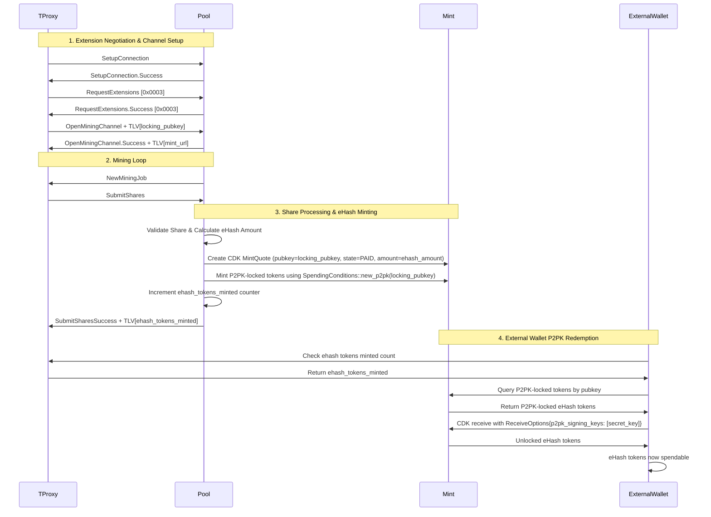
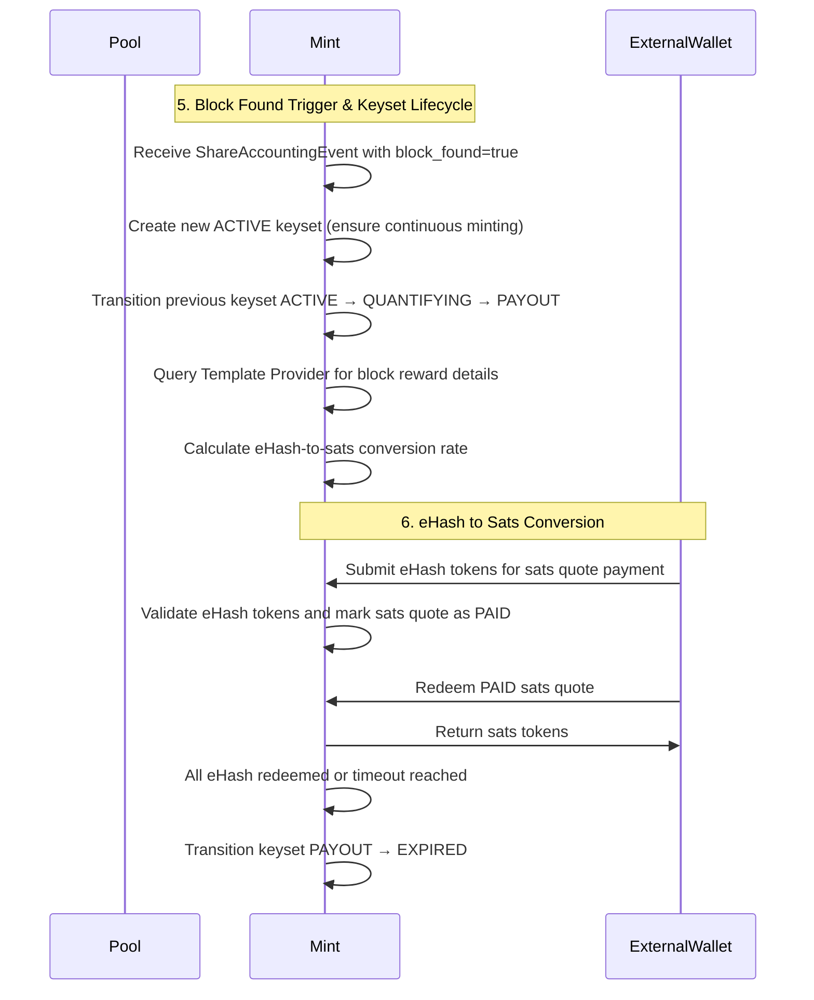
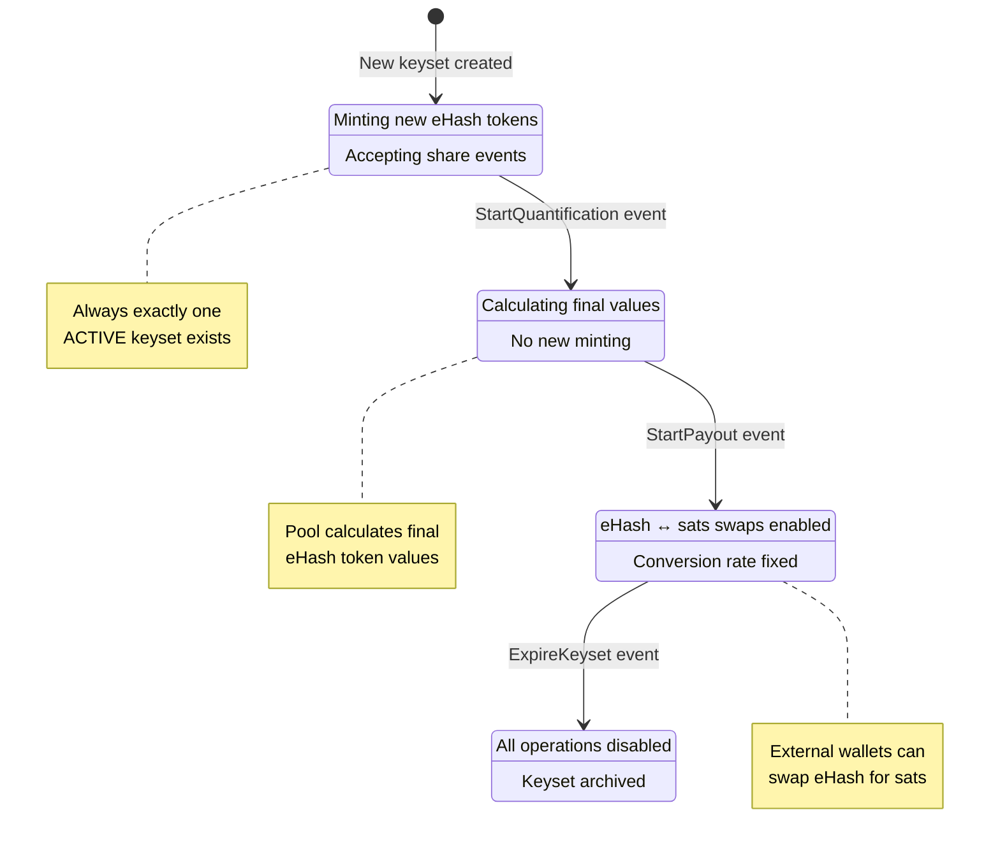

# Design Document

## Overview

This design implements hashpool.dev by integrating Cashu ecash functionality into the Stratum v2 reference implementation. The system adds two new components:

1. **Mint** - A Cashu mint daemon (mool) that replaces the existing file-based share persistence with ecash token minting
2. **Wallet** - A Cashu wallet daemon (walloxy) that automatically redeems ecash tokens based on successful share submissions

The design leverages the existing Stratum v2 architecture patterns and integrates with the CDK (Cashu Development Kit) from the existing git submodule at `deps/cdk`.

## Hashpool Research Findings

Based on analysis of the hashpool submodule at `deps/hashpool/protocols/ehash/`:

### eHash Calculation Algorithm
- **Formula**: `2^(leading_zeros - min_leading_zeros)` where `leading_zeros` is counted from share hash bytes
- **Leading Zero Calculation**: Counts leading zero bits across all 32 bytes, stopping at first non-zero bit
- **Minimum Threshold**: Configurable `min_leading_zeros` parameter (default 32 in tests) - shares below earn 0 eHash
- **Maximum Cap**: Results capped at `2^63` to stay within u64 bounds
- **Implementation**: Available in `deps/hashpool/protocols/ehash/src/work.rs`

### CDK Integration Details
- **Currency Unit**: Uses custom "HASH" unit type in CDK
- **Single-Unit Architecture**: Each CDK Wallet is tied to one CurrencyUnit (TProxy uses HASH-only wallet)
- **Keyset Structure**: 64 signing keys with amounts as powers of 2 (1, 2, 4, 8, ..., 2^63)
- **Share Hash Format**: 32-byte canonical representation with SV2 type conversions
- **Quote Protocol**: Structured requests with share hash, amount, locking pubkey, and "HASH" unit
- **eHash-to-Sats Conversion**: Use eHash tokens to create PAID quotes for sats redemption (custom mint logic)

### Key Functions Available
- `calculate_ehash_amount(hash: [u8; 32], min_leading_zeros: u32) -> u64`
- `calculate_difficulty(hash: [u8; 32]) -> u32` - counts leading zero bits
- `ShareHash` type with conversions to/from SV2 types (PubKey, U256)
- `build_mint_quote_request()` and `parse_mint_quote_request()` for SV2 protocol

### Dependency Considerations
- **Current approach**: Use `ehash = { path = "../../deps/hashpool/protocols/ehash" }`
- **Fallback option**: If API issues arise, rewrite core calculation functions in our own repo
- **Core functions needed**: `calculate_ehash_amount()`, `calculate_difficulty()`, and `ShareHash` type

## Architecture

### High-Level Component Interaction



### KeySet Sequence Diagram



### Thread Architecture

The system uses dedicated threads for eHash operations that run independently of mining operations:

- **Pool/JDC**: Spawn a Mint thread using `task_manager.spawn()` that receives EHashMintData via async channels from share validation results
- **TProxy**: Spawn a Wallet thread using the same task manager pattern that receives WalletCorrelationData via async channels from SubmitSharesSuccess events

The implementation follows this pattern:
1. Handler structs (MintHandler/WalletHandler) manage CDK instances and async channel communication
2. The main role creates handlers and gets sender/receiver channels
3. Background tasks are spawned via `task_manager.spawn()` with graceful shutdown support
4. eHash operations run independently - failures don't affect mining operations
5. Handlers include fault tolerance with retry queues and automatic recovery
6. Integration occurs at share validation points

## Share Validation Integration Strategy

### Refactored Share Validation Architecture

The recent refactoring has significantly simplified the data flow by making share hashes directly available from share validation results:

#### Available from ShareValidationResult:
- `share_hash` - Directly returned from `ShareValidationResult::Valid(share_hash)` and `ShareValidationResult::BlockFound(share_hash, template_id, coinbase)`
- `block_found` - Determined by the variant (`BlockFound` vs `Valid`)
- `template_id` - Available in `BlockFound` variant for solution propagation
- `coinbase` - Available in `BlockFound` variant

#### Available from Channel API:
- `channel_id` - Channel identifier from message context
- `user_identity` - Available via channel.get_user_identity()
- `target` - Available via channel.get_target()
- `sequence_number` - Available from SubmitSharesSuccess.last_sequence_number
- `share_work` - Calculated from target difficulty
- `extranonce_prefix` - Available via channel.get_extranonce_prefix()

#### Available from Message Context:
- `downstream_id` - Client identifier from message handling
- `timestamp` - Current system time when processing
- `share_accounting` - Available via channel.get_share_accounting()

### Integration Strategy: Event-Driven Architecture with Thread Separation

The system integrates into the share validation flow using async channels to communicate with dedicated processing threads:

1. **Share Validation Hook**: Extract data from share validation results in `handle_submit_shares_standard` and `handle_submit_shares_extended`
2. **Event Creation**: Create EHashMintData events containing all required data from the validation context
3. **Async Channel Communication**: Send events to dedicated Mint/Wallet threads via async channels
4. **Thread Separation**: Maintain clean separation between mining operations and eHash processing

### Implementation Approach
```rust
// Integration point in mining message handler
match res {
    Ok(ShareValidationResult::Valid(share_hash)) => {
        // Extract all required data from validation context
        let mint_data = EHashMintData {
            share_hash,
            channel_id,
            user_identity: standard_channel.get_user_identity().clone(),
            target: standard_channel.get_target(),
            sequence_number: msg.sequence_number,
            timestamp: SystemTime::now(),
            block_found: false,
            locking_pubkey: self.get_channel_locking_pubkey(channel_id),
        };
        
        // Send to dedicated Mint thread via async channel
        if let Some(mint_sender) = &self.mint_sender {
            let _ = mint_sender.try_send(mint_data).map_err(|e| {
                error!(target = "mint_integration", "Failed to send mint data: {}", e);
            });
        }
        
        // Continue with existing share accounting logic...
    }
    Ok(ShareValidationResult::BlockFound(share_hash, template_id, coinbase)) => {
        // Create event for block found case
        let mint_data = EHashMintData {
            share_hash,
            channel_id,
            user_identity: standard_channel.get_user_identity().clone(),
            target: standard_channel.get_target(),
            sequence_number: msg.sequence_number,
            timestamp: SystemTime::now(),
            block_found: true,
            template_id: Some(template_id),
            coinbase: Some(coinbase.clone()),
            locking_pubkey: self.get_channel_locking_pubkey(channel_id),
        };
        
        // Send to Mint thread for both minting and keyset lifecycle
        if let Some(mint_sender) = &self.mint_sender {
            let _ = mint_sender.try_send(mint_data);
        }
        
        // Continue with existing solution propagation...
    }
}
```

## Components and Interfaces

### 1. Shared eHash Module

A new shared module `common/ehash` that provides common types and functionality:

```rust
// common/ehash/src/lib.rs
#[derive(Debug, Clone)]
pub struct ShareEvent {
    pub channel_id: u32,
    pub user_identity: String,
    pub share_work: u64,
    pub share_sequence_number: u64,
    pub timestamp: SystemTime,
    pub block_found: bool,
    // Additional fields for mint payment evaluation
    pub difficulty: f64,
    pub target: U256,
}

// Shared mint handler that can be used by Pool and JDC
pub mod mint;
// Shared wallet handler that can be used by TProxy  
pub mod wallet;
// Common configuration types
pub mod config;
// Common error types
pub mod error;
```

### 2. Mint Component

The Mint component integrates directly with share validation results and leverages CDK's native database and accounting:

```rust
use cdk::{Mint as CdkMint, Amount, nuts::CurrencyUnit};
use cdk_common::database::DynMintDatabase;

pub struct MintHandler {
    /// CDK Mint instance with native database and accounting
    mint_instance: CdkMint,
    receiver: async_channel::Receiver<EHashMintData>,
    sender: async_channel::Sender<EHashMintData>,
    config: MintConfig,
    // Channel locking pubkey mapping for P2PK token creation
    channel_pubkeys: HashMap<u32, PublicKey>,
}

impl MintHandler {
    /// Create new MintHandler with CDK's native database backend
    pub async fn new(config: MintConfig, status_tx: Sender<Status>) -> Result<Self, MintError>;
    
    pub fn get_receiver(&self) -> async_channel::Receiver<EHashMintData>;
    pub fn get_sender(&self) -> async_channel::Sender<EHashMintData>;
    
    /// Main processing loop for the mint thread
    pub async fn run(&mut self) -> Result<(), MintError>;
    
    /// Main processing loop with graceful shutdown handling
    /// Completes pending mint operations before terminating
    pub async fn run_with_shutdown(&mut self, shutdown_rx: async_channel::Receiver<()>) -> Result<(), MintError>;
    
    /// Process share validation data and mint eHash tokens
    /// Uses CDK's native MintQuote and database for accounting
    pub async fn process_mint_data(&mut self, data: EHashMintData) -> Result<(), MintError>;
    
    /// Gracefully shutdown the mint handler, completing pending operations
    pub async fn shutdown(&mut self) -> Result<(), MintError>;
    
    /// Register locking pubkey for a channel (from TLV during channel setup)
    pub fn register_channel_pubkey(&mut self, channel_id: u32, pubkey: PublicKey);
    
    /// Create P2PK-locked eHash tokens using CDK's native minting
    /// Creates MintQuote in PAID state and mints tokens with P2PK spending conditions
    async fn mint_ehash_tokens(&mut self, data: &EHashMintData) -> Result<Vec<Proof>, MintError>;
    
    /// Handle block found events and trigger keyset lifecycle
    async fn handle_block_found(&mut self, data: &EHashMintData) -> Result<(), MintError>;
}

#[derive(Clone, Debug)]
pub struct MintSender {
    sender: async_channel::Sender<EHashMintData>,
}
```

### 3. Wallet Handler Component

The WalletHandler manages share correlation and focuses on HASH unit wallet operations (TProxy uses HASH unit only):

```rust
use bitcoin::secp256k1::PublicKey;
use cdk::{Wallet as CdkWallet, Amount, nuts::CurrencyUnit};

pub struct WalletHandler {
    /// CDK Wallet instance for HASH unit operations only (per CDK single-unit architecture)
    wallet_instance: Option<CdkWallet>,  // Always configured for CurrencyUnit::Custom("HASH")
    receiver: async_channel::Receiver<WalletCorrelationData>,
    sender: async_channel::Sender<WalletCorrelationData>,
    config: WalletConfig,
    locking_pubkey: PublicKey,  // Configured locking pubkey for wallet authentication
    user_identity: String,  // Derived from locking pubkey or configured
    
    // Fault tolerance fields
    retry_queue: VecDeque<WalletCorrelationData>,
    failure_count: u32,
    last_failure: Option<SystemTime>,
    max_retries: u32,
    backoff_multiplier: u64,
    recovery_enabled: bool,
}

#[derive(Debug, Clone)]
pub struct WalletCorrelationData {
    pub channel_id: u32,
    pub sequence_number: u32,
    pub user_identity: String,
    pub timestamp: SystemTime,
    pub ehash_tokens_minted: u32,
}

impl WalletHandler {
    /// Create new WalletHandler (used by both TProxy and JDC-wallet mode)
    pub async fn new(config: WalletConfig, status_tx: Sender<Status>) -> Result<Self, WalletError>;
    
    pub fn get_receiver(&self) -> async_channel::Receiver<WalletCorrelationData>;
    pub fn get_sender(&self) -> async_channel::Sender<WalletCorrelationData>;
    
    /// Main processing loop for the wallet thread
    pub async fn run(&mut self) -> Result<(), WalletError>;
    
    /// Main processing loop with graceful shutdown handling
    /// Completes pending wallet operations before terminating
    pub async fn run_with_shutdown(&mut self, shutdown_rx: async_channel::Receiver<()>) -> Result<(), WalletError>;
    
    /// Process SubmitSharesSuccess correlation data
    pub async fn process_correlation_data(&mut self, data: WalletCorrelationData) -> Result<(), WalletError>;
    
    /// Gracefully shutdown the wallet handler, completing pending operations
    pub async fn shutdown(&mut self) -> Result<(), WalletError>;
    
    /// Process correlation data with automatic retry on failure
    pub async fn process_correlation_data_with_retry(&mut self, data: WalletCorrelationData) -> Result<(), WalletError>;
    
    /// Attempt to recover from failures and process retry queue
    pub async fn attempt_recovery(&mut self) -> Result<(), WalletError>;
    
    /// Get locking pubkey for connection/channel setup
    pub fn get_locking_pubkey(&self) -> PublicKey;
    
    /// Get user identity (derived from pubkey or configured)
    pub fn get_user_identity(&self) -> &str;
    
    /// Query mint for P2PK-locked tokens by locking pubkey
    async fn query_p2pk_tokens(&self) -> Result<Vec<Proof>, WalletError>;
}
```

### 4. Thread Architecture and Integration

The system follows the existing Stratum v2 pattern of spawning dedicated threads for background processing:

```rust
// Integration in ChannelManager
pub struct ChannelManager {
    // Existing fields...
    mint_sender: Option<async_channel::Sender<EHashMintData>>,
    channel_pubkeys: HashMap<u32, PublicKey>,  // Track locking pubkeys by channel
}

impl ChannelManager {
    /// Initialize with mint thread communication
    pub fn with_mint_sender(mut self, mint_sender: async_channel::Sender<EHashMintData>) -> Self {
        self.mint_sender = Some(mint_sender);
        self
    }
    
    /// Register locking pubkey from TLV during channel setup
    pub fn register_channel_pubkey(&mut self, channel_id: u32, pubkey: PublicKey) {
        self.channel_pubkeys.insert(channel_id, pubkey);
    }
    
    /// Get locking pubkey for a channel
    fn get_channel_locking_pubkey(&self, channel_id: u32) -> Option<PublicKey> {
        self.channel_pubkeys.get(&channel_id).copied()
    }
}

// Thread spawning pattern with graceful shutdown:
// 1. Create MintHandler with config and status_tx
// 2. Get sender/receiver channels from handler
// 3. Pass sender to ChannelManager initialization
// 4. Spawn MintHandler::run() task with shutdown signal handling
// 5. Share validation events automatically flow to mint thread
// 6. Mint thread processes events independently of mining operations
// 7. On shutdown, mint thread completes pending operations before terminating

pub async fn spawn_mint_thread(
    task_manager: &mut TaskManager,
    config: MintConfig,
    status_tx: &Sender<Status>,
    shutdown_rx: async_channel::Receiver<()>,
) -> Result<async_channel::Sender<EHashMintData>, MintError> {
    let mut mint_handler = MintHandler::new(config, status_tx.clone()).await?;
    let sender = mint_handler.get_sender();
    
    task_manager.spawn("mint_handler", async move {
        mint_handler.run_with_shutdown(shutdown_rx).await
    });
    
    Ok(sender)
}

pub async fn spawn_wallet_thread(
    task_manager: &mut TaskManager,
    config: WalletConfig,
    status_tx: &Sender<Status>,
    shutdown_rx: async_channel::Receiver<()>,
) -> Result<async_channel::Sender<WalletCorrelationData>, WalletError> {
    let mut wallet_handler = WalletHandler::new(config, status_tx.clone()).await?;
    let sender = wallet_handler.get_sender();
    
    task_manager.spawn("wallet_handler", async move {
        wallet_handler.run_with_shutdown(shutdown_rx).await
    });
    
    Ok(sender)
}
```

## Data Models

### JDC Configuration Modes

The JDC role supports flexible configuration as either a Mint or Wallet:

```rust
#[derive(Debug, Deserialize)]
pub struct JdcEHashConfig {
    /// JDC eHash mode: "mint" or "wallet"
    pub mode: JdcEHashMode,
    
    /// Mint configuration (used when mode = "mint")
    pub mint: Option<MintConfig>,
    
    /// Wallet configuration (used when mode = "wallet")  
    pub wallet: Option<WalletConfig>,
}

#[derive(Debug, Deserialize, PartialEq)]
#[serde(rename_all = "lowercase")]
pub enum JdcEHashMode {
    /// JDC acts as a mint, processing share validation results
    Mint,
    /// JDC acts as a wallet, processing SubmitSharesSuccess correlation
    Wallet,
}

// JDC initialization based on configuration
impl JdcChannelManager {
    pub async fn with_ehash_config(
        mut self,
        config: JdcEHashConfig,
        task_manager: &mut TaskManager,
        status_tx: &Sender<Status>,
    ) -> Result<Self, JdcError> {
        match config.mode {
            JdcEHashMode::Mint => {
                if let Some(mint_config) = config.mint {
                    let mint_sender = spawn_mint_thread(task_manager, mint_config, status_tx).await?;
                    self.mint_sender = Some(mint_sender);
                }
            }
            JdcEHashMode::Wallet => {
                if let Some(wallet_config) = config.wallet {
                    let wallet_sender = spawn_wallet_thread(task_manager, wallet_config, status_tx).await?;
                    self.wallet_sender = Some(wallet_sender);
                }
            }
        }
        Ok(self)
    }
}
```

### Configuration Models

Integration with existing Stratum v2 TOML configuration:

```rust
use cdk::{mint_url::MintUrl, nuts::CurrencyUnit, Amount};
use cdk_common::database::MintDatabase;

#[derive(Debug, Deserialize)]
pub struct MintConfig {
    // CDK mint configuration - maps to cdk::Mint::new() parameters
    pub mint_url: MintUrl,  // cdk::mint_url::MintUrl
    pub mint_private_key: Option<String>,  // For cdk::Mint initialization
    pub supported_units: Vec<CurrencyUnit>,  // cdk::nuts::CurrencyUnit (Sat, Msat, custom units)
    
    // CDK database configuration - for cdk::cdk_database::MintDatabase
    pub database_url: Option<String>,  // For CDK database backends (sqlite, postgres, redb)
    
    // Payment logic (hashpool-specific) 
    pub min_leading_zeros: u32,  // Minimum leading zero bits required to earn 1 unit of ehash (hashpool default: 32)
    
    // Fault tolerance configuration
    pub max_retries: Option<u32>,  // Maximum retry attempts before disabling (default: 10)
    pub backoff_multiplier: Option<u64>,  // Backoff multiplier in seconds (default: 2)
    pub recovery_enabled: Option<bool>,  // Enable automatic recovery (default: true)
    
    // Integration with existing Stratum v2 config
    pub log_level: Option<String>,
}

#[derive(Debug, Deserialize)]
pub struct TProxyShareConfig {
    // Locking pubkey for wallet authentication
    pub locking_pubkey: String,  // bech32-encoded with 'hpub' prefix (e.g., "hpub1qw508d6qejxtdg4y5r3zarvary0c5xw7k...")
    
    // User identity (optional - can be derived from pubkey)
    pub user_identity: Option<String>,  // User identity to use for channels (defaults to pubkey-derived)
    
    // Mint correlation settings (HASH unit wallet only per CDK architecture)
    pub mint_url: Option<MintUrl>,  // Optional mint URL for HASH unit wallet integration
    
    // Fault tolerance configuration
    pub max_retries: Option<u32>,  // Maximum retry attempts before disabling (default: 10)
    pub backoff_multiplier: Option<u64>,  // Backoff multiplier in seconds (default: 2)
    pub recovery_enabled: Option<bool>,  // Enable automatic recovery (default: true)
    
    // Integration with existing Stratum v2 config
    pub log_level: Option<String>,
}

// Re-export CDK types for convenience
pub use cdk::nuts::CurrencyUnit as UnitType;
pub use cdk::Amount;
pub use cdk::mint_url::MintUrl;
```

### Data Models and Sources

The refactored architecture provides direct access to all required data at share validation time:

#### EHashMintData Structure
```rust
use bitcoin::hashes::sha256d::Hash;
use bitcoin::Target;

#[derive(Debug, Clone)]
pub struct EHashMintData {
    // Core share data (available from ShareValidationResult)
    pub share_hash: Hash,
    pub block_found: bool,
    
    // Channel context (available from message and channel API)
    pub channel_id: u32,
    pub user_identity: String,
    pub target: Target,
    pub sequence_number: u32,
    pub timestamp: SystemTime,
    
    // Optional template data (available in BlockFound case)
    pub template_id: Option<u64>,
    pub coinbase: Option<Vec<u8>>,
}

impl EHashMintData {
    /// Create from share validation context in Pool/JDC
    pub fn from_validation_result(
        validation_result: &ShareValidationResult,
        channel_id: u32,
        sequence_number: u32,
        channel: &dyn ChannelApi,  // Generic channel interface
    ) -> Self {
        match validation_result {
            ShareValidationResult::Valid(share_hash) => {
                Self {
                    share_hash: *share_hash,
                    block_found: false,
                    channel_id,
                    user_identity: channel.get_user_identity().clone(),
                    target: channel.get_target(),
                    sequence_number,
                    timestamp: SystemTime::now(),
                    template_id: None,
                    coinbase: None,
                }
            }
            ShareValidationResult::BlockFound(share_hash, template_id, coinbase) => {
                Self {
                    share_hash: *share_hash,
                    block_found: true,
                    channel_id,
                    user_identity: channel.get_user_identity().clone(),
                    target: channel.get_target(),
                    sequence_number,
                    timestamp: SystemTime::now(),
                    template_id: Some(*template_id),
                    coinbase: Some(coinbase.clone()),
                }
            }
        }
    }
    
    /// Calculate eHash amount using hashpool's exponential valuation method
    /// Formula: 2^(leading_zero_bits - minimum_difficulty)
    /// Returns 0 if share doesn't meet minimum difficulty threshold
    pub fn calculate_ehash_amount(&self, minimum_difficulty: u32) -> Amount {
        let hash_bytes: [u8; 32] = self.share_hash.as_byte_array().try_into().unwrap_or([0; 32]);
        let ehash_amount = ehash::calculate_ehash_amount(hash_bytes, minimum_difficulty);
        Amount::from(ehash_amount)
    }
}
```

#### JDC Role - Share Accounting Data
```rust
// JDC has access to share accounting but uses NoPersistence
// Generate ShareEvent from SubmitSharesSuccess context in JDC
impl ShareEvent {
    pub fn from_jdc_context(
        channel_id: u32,
        last_sequence_number: u32,
        new_submits_accepted_count: u32,
        new_shares_sum: u64,
        user_identity: String,
        block_found: bool,
    ) -> Self {
        ShareEvent {
            channel_id,
            user_identity,
            share_work: new_shares_sum,
            share_sequence_number: last_sequence_number as u64,
            timestamp: SystemTime::now(),
            block_found,
            share_hash: None, // Not available in JDC context
            total_shares_accepted: Some(new_submits_accepted_count),
            total_share_work_sum: Some(new_shares_sum),
            difficulty: 0.0,
            target: U256::default(),
        }
    }
}
```

#### TProxy Role - SubmitSharesSuccess
```rust
// TProxy creates ShareEvent with correlation key for wallet redemption
impl ShareEvent {
    pub fn from_submit_shares_success(
        msg: SubmitSharesSuccess, 
        user_identity: String
    ) -> Self {
        let correlation_key = ShareCorrelationKey {
            channel_id: msg.channel_id,
            sequence_number: msg.last_sequence_number as u64,
            user_identity: user_identity.clone(),
        };
        
        ShareEvent {
            channel_id: msg.channel_id,
            user_identity,
            share_work: msg.new_shares_sum,
            share_sequence_number: msg.last_sequence_number as u64,
            timestamp: SystemTime::now(),
            block_found: false, // TProxy doesn't know about block finds
            share_hash: None, // Not available in TProxy
            total_shares_accepted: Some(msg.new_submits_accepted_count),
            total_share_work_sum: Some(msg.new_shares_sum),
            difficulty: 0.0,
            target: U256::default(),
            correlation_key,
        }
    }
}

// TProxy wallet uses correlation key to query mint for matching eHash tokens
pub struct WalletRedemptionQuery {
    pub mint_url: MintUrl,
    pub correlation_key: ShareCorrelationKey,
    pub sequence_range: Option<(u64, u64)>,  // For batch redemptions
}
```

#### Updated ShareEvent Structure
```rust
use bitcoin::hashes::sha256d::Hash;

#[derive(Debug, Clone)]
pub struct ShareEvent {
    // Core correlation fields (available in both Pool/JDC and TProxy)
    pub channel_id: u32,
    pub user_identity: String,
    pub share_sequence_number: u64,
    pub timestamp: SystemTime,
    pub share_work: u64,
    
    // Pool/JDC specific fields (for eHash calculation)
    pub share_hash: Option<Hash>,  // Used to calculate leading zeros for eHash amount
    pub block_found: bool,
    pub total_shares_accepted: Option<u32>,
    pub total_share_work_sum: Option<u64>,
    pub difficulty: f64,
    pub target: U256,
    
    // Correlation metadata
    pub correlation_key: ShareCorrelationKey,
}

impl ShareEvent {
    /// Calculate eHash amount using hashpool's exponential valuation method
    /// Formula: 2^(leading_zero_bits - minimum_difficulty)
    /// Returns 0 if share doesn't meet minimum difficulty threshold
    pub fn calculate_ehash_amount(&self, minimum_difficulty: u32) -> Amount {
        if let Some(hash) = &self.share_hash {
            let hash_bytes: [u8; 32] = hash.as_byte_array().try_into().unwrap_or([0; 32]);
            let ehash_amount = ehash::calculate_ehash_amount(hash_bytes, minimum_difficulty);
            Amount::from(ehash_amount)
        } else {
            Amount::from(0)
        }
    }
}

// Re-export hashpool's calculation functions from deps/hashpool/protocols/ehash
pub use ehash::{calculate_ehash_amount, calculate_difficulty};
```

## Error Handling

### Error Types

Integration with existing Stratum v2 Status system:

```rust
#[derive(Debug)]
pub enum MintError {
    CdkError(cdk::Error),
    ConfigError(String),
    ChannelError(String),
    PaymentEvaluationError(String),
}

#[derive(Debug)]
pub enum WalletError {
    CdkError(cdk::Error),
    ConfigError(String),
    ChannelError(String),
    RedemptionError(String),
    NetworkError(String),
}

// Integration with existing Status system
impl From<MintError> for Status {
    fn from(error: MintError) -> Self {
        Status {
            state: State::MintError(error.to_string()),
        }
    }
}
```

### Error Recovery and Fault Tolerance

The system is designed with fault tolerance to ensure mining operations continue even when eHash operations fail:

#### Thread Independence
- **Mining Thread Isolation**: Mining operations (share validation, solution propagation) continue normally even if Mint/Wallet threads fail
- **eHash Thread Isolation**: Mint/Wallet thread failures don't affect core mining functionality
- **Optional eHash Operations**: All eHash functionality is optional - mining works without it

#### Failure Scenarios and Recovery

##### Mint Thread Failures
- **Pool/JDC Behavior**: Continue normal mining operations, log mint failures
- **Event Queuing**: Failed mint events are queued for retry with exponential backoff
- **Automatic Recovery**: Attempt to restart mint thread after configurable delay
- **Fallback Mode**: If mint consistently fails, disable eHash minting but continue mining
- **Status Reporting**: Report mint status via existing Status system without affecting mining

##### Wallet Thread Failures  
- **TProxy Behavior**: Continue normal translation operations, log wallet failures
- **Correlation Queuing**: Failed correlation events are queued for retry
- **Automatic Recovery**: Attempt to restart wallet thread after configurable delay
- **Fallback Mode**: If wallet consistently fails, disable correlation tracking but continue translation
- **Status Reporting**: Report wallet status independently of translation status

##### CDK/Network Failures
- **Transient Failures**: Implement exponential backoff for CDK operations (mint, wallet, network)
- **Persistent Failures**: After max retries, disable eHash operations but continue mining
- **Network Partitions**: Queue operations during network issues, replay when connectivity restored
- **Database Failures**: Use CDK's built-in database recovery mechanisms

#### Recovery Implementation Strategy

```rust
pub struct MintHandler {
    // ... existing fields ...
    retry_queue: VecDeque<EHashMintData>,
    failure_count: u32,
    last_failure: Option<SystemTime>,
    max_retries: u32,
    backoff_multiplier: u64,
    recovery_enabled: bool,
}

impl MintHandler {
    /// Process mint data with automatic retry on failure
    pub async fn process_mint_data_with_retry(&mut self, data: EHashMintData) -> Result<(), MintError> {
        match self.process_mint_data(data.clone()).await {
            Ok(()) => {
                // Reset failure count on success
                self.failure_count = 0;
                self.last_failure = None;
                Ok(())
            }
            Err(e) => {
                // Queue for retry and increment failure count
                self.retry_queue.push_back(data);
                self.failure_count += 1;
                self.last_failure = Some(SystemTime::now());
                
                // Disable if too many failures
                if self.failure_count > self.max_retries {
                    warn!("Mint thread disabled after {} failures", self.max_retries);
                    self.recovery_enabled = false;
                }
                
                Err(e)
            }
        }
    }
    
    /// Attempt to recover from failures
    pub async fn attempt_recovery(&mut self) -> Result<(), MintError> {
        if !self.recovery_enabled {
            return Ok(());
        }
        
        // Exponential backoff
        if let Some(last_failure) = self.last_failure {
            let backoff_duration = Duration::from_secs(
                self.backoff_multiplier * (2_u64.pow(self.failure_count.min(10)))
            );
            
            if last_failure.elapsed().unwrap_or(Duration::ZERO) < backoff_duration {
                return Ok(());
            }
        }
        
        // Process retry queue
        while let Some(data) = self.retry_queue.pop_front() {
            match self.process_mint_data(data.clone()).await {
                Ok(()) => {
                    info!("Mint recovery successful");
                    self.failure_count = 0;
                    self.last_failure = None;
                }
                Err(_) => {
                    // Put back in queue and stop processing
                    self.retry_queue.push_front(data);
                    break;
                }
            }
        }
        
        Ok(())
    }
}
```

#### Integration with Mining Operations

```rust
// In ChannelManager share validation
match res {
    Ok(ShareValidationResult::Valid(share_hash)) => {
        // ALWAYS continue with mining operations regardless of mint status
        let response = SubmitSharesSuccess { /* ... */ };
        
        // TRY to send to mint thread (non-blocking)
        if let Some(mint_sender) = &self.mint_sender {
            let mint_data = EHashMintData { /* ... */ };
            
            // Use try_send to avoid blocking mining operations
            if let Err(e) = mint_sender.try_send(mint_data) {
                // Log error but don't fail the mining operation
                warn!("Failed to send mint data: {}, mining continues", e);
            }
        }
        
        // Continue with normal mining flow
        Ok(response)
    }
}
```

### Graceful Shutdown Strategy

The Mint and Wallet threads require special shutdown handling to ensure data integrity:

#### Mint Thread Shutdown
1. **Signal Reception**: Mint thread receives shutdown signal via dedicated channel
2. **Channel Closure**: Stop accepting new EHashMintData events by closing receiver
3. **Pending Operations**: Complete all pending mint operations in the queue
4. **CDK Cleanup**: Properly close CDK Mint instance and database connections
5. **State Persistence**: Ensure all minted tokens are properly recorded
6. **Thread Termination**: Exit gracefully after cleanup completion

#### Wallet Thread Shutdown
1. **Signal Reception**: Wallet thread receives shutdown signal via dedicated channel
2. **Channel Closure**: Stop accepting new WalletCorrelationData events
3. **Pending Redemptions**: Complete any in-progress token redemption operations
4. **CDK Cleanup**: Properly close CDK Wallet instance and network connections
5. **State Persistence**: Ensure wallet state is properly saved
6. **Thread Termination**: Exit gracefully after cleanup completion

#### Implementation Pattern
```rust
pub async fn run_with_shutdown(&mut self, shutdown_rx: async_channel::Receiver<()>) -> Result<(), MintError> {
    loop {
        tokio::select! {
            // Process incoming events
            event = self.receiver.recv() => {
                match event {
                    Ok(data) => self.process_mint_data(data).await?,
                    Err(_) => break, // Channel closed
                }
            }
            // Handle shutdown signal
            _ = shutdown_rx.recv() => {
                info!("Mint thread received shutdown signal, completing pending operations...");
                self.shutdown().await?;
                break;
            }
        }
    }
    Ok(())
}
```

## Testing Strategy

### Unit Testing

Focus on eHash-specific functionality (Stratum v2 and CDK unit tests are handled by upstream crates):

1. **eHash-Specific Tests**
   - ShareEvent processing and conversion from share validation results
   - EHashMintData creation from validation context
   - WalletCorrelationData processing from SubmitSharesSuccess
   - eHash amount calculation using hashpool functions
   - Share hash extraction and conversion to CDK types

### Integration Testing

1. **End-to-End Flow Tests**
   - Pool → Mint → Wallet redemption flow
   - JDC → Mint → Wallet redemption flow
   - Multi-unit type support (sats and hash)

2. **Thread Communication Tests**
   - Share validation to EHashMintData flow
   - SubmitSharesSuccess to WalletCorrelationData flow
   - Async channel reliability under load

## Module Structure and Dependencies

### Shared eHash Module
```toml
# common/ehash/Cargo.toml
[dependencies]
cdk = { path = "../../deps/cdk/crates/cdk", features = ["mint", "wallet"] }
cdk-common = { path = "../../deps/cdk/crates/cdk-common" }
ehash = { path = "../../deps/hashpool/protocols/ehash" }
stratum-apps = { path = "../../roles/stratum-apps" }  # For share validation integration
bitcoin = { version = "0.32.2", features = ["secp256k1"] }
# Other common dependencies...
```

### Role Dependencies

```toml
# Pool and JDC Cargo.toml files (need full CDK mint functionality)
[dependencies]
ehash = { path = "../../common/ehash" }
stratum-apps = { path = "../stratum-apps" }  # For updated persistence traits
# Existing dependencies...

# TProxy Cargo.toml file (only needs share correlation functionality)
[dependencies]
ehash = { path = "../../common/ehash", default-features = false, features = ["share-correlation"] }
# Existing dependencies...
```

## Implementation Notes

### Hashpool Research Results

Based on analysis of the hashpool submodule at `deps/hashpool`, the following has been determined:

1. **eHash Calculation Algorithm**: Uses exponential valuation `2^(leading_zero_bits - minimum_difficulty)` from `deps/hashpool/protocols/ehash/src/work.rs`
2. **Minimum Threshold Logic**: Configurable `minimum_difficulty` parameter (default: 32 leading zero bits) from shared config
3. **Calculation Implementation**: Available functions `calculate_ehash_amount()` and `calculate_difficulty()` in ehash crate
4. **Configuration**: Uses `EhashConfig { minimum_difficulty: u32 }` structure in shared configuration
5. **Integration Pattern**: Pool processes shares and sends mint quote requests to separate mint daemon via SV2 messaging

### Remaining Research Items

1. **Keyset Lifecycle Timing**: Understand the exact triggers and timing for keyset state transitions
2. **External Wallet Integration**: Research the specific protocols hashpool uses for external wallet redemption
3. **SV2 Extension Protocol**: Analyze hashpool's SV2 extension implementation for eHash negotiation

### CDK Integration Points

1. **Submodule Integration**: Use the existing CDK submodule at `deps/cdk` (tagged v0.13.x version)
2. **Mint Initialization**: Use CDK's `cdk::Mint` with custom unit support via the `mint` feature
3. **Wallet Initialization**: Use CDK's `cdk::Wallet` with multi-mint support via the `wallet` feature  
4. **Token Operations**: Leverage CDK's minting and redemption protocols from `cdk::nuts`
5. **Unit Support**: Configure CDK for both Bitcoin (sats) and custom hash units using `cdk::Amount`
6. **Database Integration**: Use CDK's database abstractions (`cdk::cdk_database`) for persistence

### Compatibility Considerations

1. **CDK Submodule**: Leverage the existing CDK submodule at `deps/cdk` (tagged v0.13.x version)
2. **Hashpool Submodule**: Use the existing hashpool submodule at `deps/hashpool` for ehash calculations
3. **Stratum-Apps Integration**: Use the current share validation architecture from `stratum-apps` crate
6. **Network Difficulty**: Access current network difficulty from existing Stratum v2 template/job context
7. **Configuration**: Extend existing TOML structures without breaking changes
8. **Status System**: Integrate new error types with existing Status enum
9. **Thread Management**: Follow existing patterns for thread spawning and management

### Deployment Flexibility

1. **Optional Components**: Allow disabling ecash functionality via configuration
2. **Independent Operation**: eHash operations run independently of core mining functionality
3. **Multi-Instance**: Support multiple mint/wallet instances for different unit types
4. **Network Configuration**: Flexible mint URL configuration for different deployment scenarios

### Key Protocol Elements

- **Locking Pubkeys**: Enable wallet authentication with mint (established at connection setup)
- **PAID Quotes**: Pool creates quotes in PAID status when shares are validated  
- **Channel/Sequence Correlation**: Unique identifiers (channel_id, sequence_number) for quote lookup
- **Blinded Secrets**: Standard Cashu protocol for privacy-preserving token minting

### Implementation Impact

This uses locking pubkeys for authentication and channel/sequence for correlation:

1. **TProxy**: Configured with locking pubkey, exchanges it during connection setup
2. **Pool (Mool)**: Creates PAID quotes tagged with (channel_id, sequence_number) and associated with locking pubkey
3. **External Wallet**: Authenticates with locking pubkey and queries quotes by (channel_id, sequence_number)
4. **Mint**: Supports quote lookup by locking pubkey authentication + (channel_id, sequence_number) filtering

## eHash as Stratum v2 Extension

Following the SV2 extension specification, eHash functionality will be implemented as Extension Type `0x0003`:

### Extension Negotiation

1. **Connection Setup**:
   ```
   Client --- SetupConnection ---> Server
   Client <--- SetupConnection.Success ---- Server
   ```

2. **Extension Request**:
   ```
   Client --- RequestExtensions [0x0003] ---> Server
   Client <--- RequestExtensions.Success [0x0003] ---- Server
   ```

### TLV Fields for eHash Extension

When extension `0x0003` is negotiated, the following TLV fields are available:

| Field Type | TLV Type | Description |
|------------|----------|-------------|
| `0x01` | `0x0003\|0x01` | `locking_pubkey` - 33-byte compressed public key |
| `0x02` | `0x0003\|0x02` | `mint_url` - UTF-8 encoded mint URL |
| `0x03` | `0x0003\|0x03` | `outstanding_quotes` - U32 count of pending quotes for this locking_pubkey |

### Modified Message Flow

#### 1. Channel Setup with eHash
- **TProxy → Pool**: `OpenStandardMiningChannel` or `OpenExtendedMiningChannel` with TLV:
  ```
  [0x0003|0x01] [0x0021] [33-byte compressed pubkey]
  ```

- **Pool → TProxy**: `OpenMiningChannel.Success` with TLV:
  ```
  [0x0003|0x02] [LENGTH] [mint_url]
  ```

#### 2. Share Submission (No Changes)
- Standard `SubmitSharesStandard` or `SubmitSharesExtended` messages
- No TLV modifications needed for share submission

#### 3. Share Response with eHash Info
- **Pool → TProxy**: `SubmitSharesSuccess` with optional TLV:
  ```
  [0x0003|0x03] [0x0004] [outstanding_quotes_count]
  ```

### Protocol Flow with CDK P2PK Integration

1. **Extension Negotiation**: Client requests eHash extension support
2. **Channel Setup**: TProxy includes locking pubkey in channel open message
3. **Share Processing**: Pool validates shares and creates CDK tokens with P2PK locking:
   - Uses `SpendingConditions::new_p2pk(locking_pubkey, None)` 
   - Creates `MintQuote` in `MintQuoteState::Paid` state
   - Mints tokens locked to the TProxy's pubkey using CDK's P2PK mechanism
4. **External Redemption**: Wallets use CDK's P2PK redemption:
   - Query mint for quotes by pubkey
   - Redeem P2PK-locked tokens using `ReceiveOptions` with `p2pk_signing_keys`

### Implementation Benefits

- **Standards Compliant**: Follows established SV2 extension patterns
- **Backward Compatible**: Non-eHash clients work normally
- **Minimal Overhead**: Only adds TLV fields when extension is negotiated
- **Clean Separation**: eHash logic is clearly separated from core mining protocol##
 eHash Keyset Lifecycle Management

### Keyset State Machine

eHash keysets follow a specific lifecycle with trigger events from the Pool:

```
ACTIVE → QUANTIFYING → PAYOUT → EXPIRED
```

#### State Machine Diagram



#### State Definitions

- **ACTIVE**: Keyset is actively minting new eHash tokens for incoming shares
- **QUANTIFYING**: Pool is calculating final eHash token values (no new minting)
- **PAYOUT**: eHash tokens can be swapped for sats (ecash or LN) at determined rates
- **EXPIRED**: Keyset is no longer valid

### Mint-Driven Lifecycle Management

The Mint monitors for payout events and manages keyset transitions autonomously:

```rust
#[derive(Debug, Clone)]
pub enum PayoutTrigger {
    /// Block found - detected via Template Provider integration
    BlockReward {
        block_height: u64,
        reward_amount: Amount,  // Total block reward in sats
        timestamp: SystemTime,
    },
    /// BOLT12 payment received - detected via LDK integration
    Bolt12Payment {
        payment_amount: Amount,  // Payment amount in sats
        payment_hash: String,    // For verification this is a mining payout
        timestamp: SystemTime,
    },
}
```

### Mint Payout Detection and Processing

The Mint monitors for payout events and manages keyset transitions:

```rust
impl MintHandler {
    /// Process ShareAccountingEvent and check for block found trigger
    pub async fn process_share_event(&mut self, event: ShareAccountingEvent) -> Result<(), MintError> {
        match event {
            ShareAccountingEvent::ShareAccepted { block_found, .. } => {
                // Mint eHash tokens for the share
                self.mint_ehash_for_share(&event).await?;
                
                // Check if this share found a block
                if block_found {
                    // Query Template Provider for detailed block reward information
                    let block_reward = self.get_block_reward_from_template_provider().await?;
                    
                    self.handle_payout_trigger(PayoutTrigger::BlockReward {
                        block_height: block_reward.height,
                        reward_amount: block_reward.amount,
                        timestamp: event.timestamp,
                    }).await?;
                }
            },
            ShareAccountingEvent::BestDifficultyUpdated { .. } => {
                // Handle difficulty updates if needed
            }
        }
        
        // Monitor LDK for BOLT12 payments
        if let Some(bolt12_payment) = self.check_ldk_for_mining_payouts().await? {
            self.handle_payout_trigger(PayoutTrigger::Bolt12Payment {
                payment_amount: bolt12_payment.amount,
                payment_hash: bolt12_payment.hash,
                timestamp: SystemTime::now(),
            }).await?;
        }
        
        Ok(())
    }
    
    pub async fn handle_payout_trigger(&mut self, trigger: PayoutTrigger) -> Result<(), MintError> {
        let active_keyset_id = self.get_active_keyset_id();
        let outstanding_ehash_amount = self.get_outstanding_ehash_amount(active_keyset_id).await?;
        
        // Calculate eHash to sats conversion rate
        let payout_amount = match trigger {
            PayoutTrigger::BlockReward { reward_amount, .. } => reward_amount,
            PayoutTrigger::Bolt12Payment { payment_amount, .. } => payment_amount,
        };
        
        let ehash_to_sats_rate = payout_amount.as_f64() / outstanding_ehash_amount.as_f64();
        
        // Transition keyset lifecycle
        self.rotate_to_new_active_keyset().await?;
        self.transition_keyset_to_quantifying(active_keyset_id).await?;
        self.transition_keyset_to_payout(active_keyset_id, ehash_to_sats_rate).await?;
        
        Ok(())
    }
    
    /// Query Template Provider for block reward details
    async fn get_block_reward_from_template_provider(&self, block_height: u64) -> Result<BlockReward, MintError> {
        // Query Template Provider for detailed block information
        // Calculate total reward (coinbase + fees) for the specified block
    }
    
    /// Check LDK for BOLT12 mining payout payments
    async fn check_ldk_for_mining_payouts(&self) -> Result<Option<Bolt12Payment>, MintError> {
        // Integration with LDK to detect BOLT12 payments
        // Filter for payments that match mining payout criteria
    }
}
```

### eHash to Sats Conversion

During the PAYOUT phase, eHash tokens can be swapped for sats:

```rust
pub struct EHashSwapRequest {
    pub ehash_tokens: Vec<Proof>,  // P2PK-locked eHash tokens
    pub target_unit: CurrencyUnit, // Sat or other supported unit
    pub swap_rate: f64,            // eHash to sats conversion rate
}

impl MintHandler {
    /// Swap eHash tokens for sats during PAYOUT phase
    pub async fn swap_ehash_for_sats(
        &mut self, 
        request: EHashSwapRequest
    ) -> Result<Vec<Proof>, MintError> {
        // 1. Verify keyset is in PAYOUT state
        // 2. Validate eHash tokens
        // 3. Calculate sats amount using swap_rate
        // 4. Mint new sats tokens
        // 5. Burn eHash tokens
    }
}
```
## Locking Pubkey Encoding

### bech32 Encoding with 'hpub' Prefix

For configuration and display purposes, locking pubkeys use bech32 encoding with the 'hpub' prefix:

```rust
use bitcoin::bech32::{self, ToBase32, FromBase32};

/// Encode a public key to bech32 format with 'hpub' prefix
pub fn encode_locking_pubkey(pubkey: &PublicKey) -> Result<String, EncodingError> {
    let data = pubkey.serialize().to_base32();
    bech32::encode("hpub", data, bech32::Variant::Bech32)
        .map_err(EncodingError::Bech32)
}

/// Decode a bech32-encoded locking pubkey with 'hpub' prefix
pub fn decode_locking_pubkey(encoded: &str) -> Result<PublicKey, EncodingError> {
    let (hrp, data, _variant) = bech32::decode(encoded)
        .map_err(EncodingError::Bech32)?;
    
    if hrp != "hpub" {
        return Err(EncodingError::InvalidPrefix(hrp));
    }
    
    let bytes = Vec::<u8>::from_base32(&data)
        .map_err(EncodingError::Bech32)?;
    
    PublicKey::from_slice(&bytes)
        .map_err(EncodingError::InvalidPubkey)
}
```

### Configuration Example

```toml
# TProxy configuration
[ehash]
locking_pubkey = "hpub1qw508d6qejxtdg4y5r3zarvary0c5xw7kv8f3t4"
mint_url = "https://mint.hashpool.dev"
```

### Benefits

- **Human-readable**: bech32 encoding with checksums prevents typos
- **Distinctive prefix**: 'hpub' clearly identifies hashpool locking pubkeys
- **Standard format**: Consistent with Bitcoin address encoding practices
- **Error detection**: Built-in checksum validation