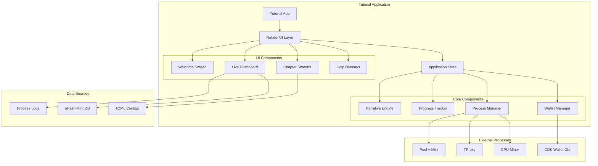

# Design Document

## Overview

This design implements an Interactive eHash Tutorial using Ratatui that provides a comprehensive, step-by-step educational experience through the narrative of three users: the Pool Operator, Proxy Operator, and Pioneer. The tutorial builds on the existing ehashimint infrastructure to create a guided, hands-on learning experience that shows real eHash operations as they happen.

## Awesome Ratatui Reference Projects

Based on analysis of https://github.com/ratatui/awesome-ratatui, the following projects provide excellent patterns and utilities for our tutorial:

### Core Architecture References

**[tui-big-text](https://github.com/joshka/tui-big-text)** - For impressive chapter title screens and welcome banners
**[tui-scrollview](https://github.com/joshka/tui-scrollview)** - Essential for scrollable log views and long educational content
**[tui-textarea](https://github.com/rhymu8354/tui-textarea)** - For interactive command input with tab completion
**[tui-input](https://github.com/sayanarijit/tui-input)** - Alternative for command line input with history
**[tui-popup](https://github.com/joshka/tui-popup)** - For help overlays, confirmations, and contextual explanations

### Dashboard and Visualization

**[tui-logger](https://github.com/gin66/tui-logger)** - For real-time log display from Pool, TProxy, and miner processes
**[tui-tree-widget](https://github.com/EdJoPaTo/tui-rs-tree-widget)** - For hierarchical display of process status and eHash flow
**[ratatui-image](https://github.com/benjajaja/ratatui-image)** - For displaying QR codes of hpub addresses and visual diagrams

### Navigation and User Experience

**[color-eyre](https://github.com/eyre-rs/eyre)** - For beautiful error handling and debugging information
**[tui-input](https://github.com/sayanarijit/tui-input)** - For clean input handling during wallet creation and configuration
**[crossterm](https://github.com/crossterm-rs/crossterm)** - Already used by Ratatui, for cross-platform terminal handling

### Interactive Command System

**[tui-input](https://github.com/sayanarijit/tui-input)** - For clean command input with history and completion
**[rustyline](https://github.com/kkawakam/rustyline)** - Reference for advanced tab completion and command history
**[clap](https://github.com/clap-rs/clap)** - For parsing and validating tutorial commands

### Educational Content Management

**[tui-markdown](https://github.com/joshka/tui-markdown)** - For rendering rich educational content and help documentation
**[nutshell](https://github.com/joshka/nutshell)** - Excellent reference for complex TUI application architecture

### Process Management Integration

**[bottom](https://github.com/ClementTsang/bottom)** - Reference for system monitoring and process visualization
**[gitui](https://github.com/extrawurst/gitui)** - Excellent patterns for complex state management and user workflows

## Architecture

### High-Level Component Structure



### State Machine Architecture

The tutorial uses a lightweight state machine pattern for managing chapter progression and tutorial flow. This provides clear state transitions and makes the tutorial logic easy to reason about:

```rust
use ratatui::prelude::*;
use crossterm::event::{Event, KeyCode, KeyEvent};
use tokio::sync::mpsc;

/// Main tutorial state machine
#[derive(Debug, Clone)]
pub struct TutorialStateMachine {
    /// Current state
    pub current_state: TutorialState,
    
    /// State transition history for debugging/replay
    pub state_history: Vec<(Instant, TutorialState)>,
    
    /// Pending state transitions
    pub pending_transitions: Vec<StateTransition>,
}

#[derive(Debug, Clone, PartialEq)]
pub enum TutorialState {
    /// Initial welcome and setup
    Welcome,
    
    /// Chapter 1: Pool Operator states
    PoolOperator(PoolOperatorState),
    
    /// Chapter 2: Proxy Operator states  
    ProxyOperator(ProxyOperatorState),
    
    /// Chapter 3: Pioneer states
    Pioneer(PioneerState),
    
    /// Chapter 4: Complete ecosystem
    CompleteEcosystem(EcosystemState),
    
    /// Error states
    Error(ErrorState),
    
    /// Tutorial completion
    Complete,
}

#[derive(Debug, Clone, PartialEq)]
pub enum PoolOperatorState {
    Introduction,
    ConfiguringPool,
    StartingPool,
    StartingMintApi,
    WaitingForConnections,
    PoolReady,
}

#[derive(Debug, Clone, PartialEq)]
pub enum ProxyOperatorState {
    Introduction,
    CreatingWallet,
    DerivingHpub,
    ConfiguringTProxy,
    StartingTProxy,
    ConnectingToPool,
    WaitingForMiners,
    ProxyReady,
}

#[derive(Debug, Clone, PartialEq)]
pub enum PioneerState {
    Introduction,
    CreatingWallet,
    DerivingHpub,
    StartingMiner,
    ConnectingToProxy,
    Mining,
    WaitingForTokens,
    QueryingMint,
    RedeemingTokens,
    PioneerComplete,
}

#[derive(Debug, Clone, PartialEq)]
pub enum EcosystemState {
    ShowingCompleteSystem,
    MultiMinerDemo,
    BlockFoundDemo,
    KeysetLifecycleDemo,
    EcosystemComplete,
}

#[derive(Debug, Clone, PartialEq)]
pub enum ErrorState {
    ProcessFailed { process: String, error: String },
    WalletError { operation: String, error: String },
    ConfigurationError { message: String },
    RecoveryOptions { options: Vec<RecoveryOption> },
}

/// State transition triggers
#[derive(Debug, Clone)]
pub enum StateTransition {
    /// User-triggered transitions
    UserAdvance,
    UserGoBack,
    UserSkipStep,
    UserReset,
    
    /// Event-triggered transitions
    ProcessStarted(String),
    ProcessFailed(String, String),
    WalletCreated(UserType),
    ShareSubmitted,
    TokensMinted { amount: u64 },
    TokensRedeemed { amount: u64 },
    
    /// Time-based transitions
    Timeout,
    
    /// Error recovery
    RetryOperation,
    SkipFailedStep,
}

impl TutorialStateMachine {
    /// Create new state machine starting at Welcome
    pub fn new() -> Self {
        Self {
            current_state: TutorialState::Welcome,
            state_history: Vec::new(),
            pending_transitions: Vec::new(),
        }
    }
    
    /// Process a state transition
    pub fn transition(&mut self, transition: StateTransition) -> Result<(), StateError> {
        let new_state = self.calculate_next_state(&self.current_state, &transition)?;
        
        // Validate transition is allowed
        if !self.is_valid_transition(&self.current_state, &new_state) {
            return Err(StateError::InvalidTransition {
                from: self.current_state.clone(),
                to: new_state,
                trigger: transition,
            });
        }
        
        // Record transition
        self.state_history.push((Instant::now(), self.current_state.clone()));
        
        // Execute transition
        self.current_state = new_state;
        
        Ok(())
    }
    
    /// Calculate next state based on current state and transition
    fn calculate_next_state(
        &self,
        current: &TutorialState,
        transition: &StateTransition,
    ) -> Result<TutorialState, StateError> {
        use TutorialState::*;
        use StateTransition::*;
        
        match (current, transition) {
            // Welcome screen transitions
            (Welcome, UserAdvance) => Ok(PoolOperator(PoolOperatorState::Introduction)),
            
            // Pool Operator state transitions
            (PoolOperator(PoolOperatorState::Introduction), UserAdvance) => {
                Ok(PoolOperator(PoolOperatorState::ConfiguringPool))
            }
            (PoolOperator(PoolOperatorState::ConfiguringPool), UserAdvance) => {
                Ok(PoolOperator(PoolOperatorState::StartingPool))
            }
            (PoolOperator(PoolOperatorState::StartingPool), ProcessStarted(name)) if name == "pool" => {
                Ok(PoolOperator(PoolOperatorState::StartingMintApi))
            }
            (PoolOperator(PoolOperatorState::StartingMintApi), ProcessStarted(name)) if name == "mint_api" => {
                Ok(PoolOperator(PoolOperatorState::WaitingForConnections))
            }
            (PoolOperator(PoolOperatorState::WaitingForConnections), UserAdvance) => {
                Ok(PoolOperator(PoolOperatorState::PoolReady))
            }
            (PoolOperator(PoolOperatorState::PoolReady), UserAdvance) => {
                Ok(ProxyOperator(ProxyOperatorState::Introduction))
            }
            
            // Proxy Operator state transitions
            (ProxyOperator(ProxyOperatorState::Introduction), UserAdvance) => {
                Ok(ProxyOperator(ProxyOperatorState::CreatingWallet))
            }
            (ProxyOperator(ProxyOperatorState::CreatingWallet), WalletCreated(UserType::ProxyOperator)) => {
                Ok(ProxyOperator(ProxyOperatorState::DerivingHpub))
            }
            (ProxyOperator(ProxyOperatorState::DerivingHpub), UserAdvance) => {
                Ok(ProxyOperator(ProxyOperatorState::ConfiguringTProxy))
            }
            (ProxyOperator(ProxyOperatorState::ConfiguringTProxy), UserAdvance) => {
                Ok(ProxyOperator(ProxyOperatorState::StartingTProxy))
            }
            (ProxyOperator(ProxyOperatorState::StartingTProxy), ProcessStarted(name)) if name == "tproxy" => {
                Ok(ProxyOperator(ProxyOperatorState::ConnectingToPool))
            }
            (ProxyOperator(ProxyOperatorState::ConnectingToPool), UserAdvance) => {
                Ok(ProxyOperator(ProxyOperatorState::WaitingForMiners))
            }
            (ProxyOperator(ProxyOperatorState::WaitingForMiners), UserAdvance) => {
                Ok(ProxyOperator(ProxyOperatorState::ProxyReady))
            }
            (ProxyOperator(ProxyOperatorState::ProxyReady), UserAdvance) => {
                Ok(Pioneer(PioneerState::Introduction))
            }
            
            // Pioneer state transitions
            (Pioneer(PioneerState::Introduction), UserAdvance) => {
                Ok(Pioneer(PioneerState::CreatingWallet))
            }
            (Pioneer(PioneerState::CreatingWallet), WalletCreated(UserType::Pioneer)) => {
                Ok(Pioneer(PioneerState::DerivingHpub))
            }
            (Pioneer(PioneerState::DerivingHpub), UserAdvance) => {
                Ok(Pioneer(PioneerState::StartingMiner))
            }
            (Pioneer(PioneerState::StartingMiner), ProcessStarted(name)) if name == "miner" => {
                Ok(Pioneer(PioneerState::ConnectingToProxy))
            }
            (Pioneer(PioneerState::ConnectingToProxy), ShareSubmitted) => {
                Ok(Pioneer(PioneerState::Mining))
            }
            (Pioneer(PioneerState::Mining), TokensMinted { .. }) => {
                Ok(Pioneer(PioneerState::WaitingForTokens))
            }
            (Pioneer(PioneerState::WaitingForTokens), UserAdvance) => {
                Ok(Pioneer(PioneerState::QueryingMint))
            }
            (Pioneer(PioneerState::QueryingMint), UserAdvance) => {
                Ok(Pioneer(PioneerState::RedeemingTokens))
            }
            (Pioneer(PioneerState::RedeemingTokens), TokensRedeemed { .. }) => {
                Ok(Pioneer(PioneerState::PioneerComplete))
            }
            (Pioneer(PioneerState::PioneerComplete), UserAdvance) => {
                Ok(CompleteEcosystem(EcosystemState::ShowingCompleteSystem))
            }
            
            // Error handling transitions
            (_, ProcessFailed(process, error)) => {
                Ok(Error(ErrorState::ProcessFailed {
                    process: process.clone(),
                    error: error.clone(),
                }))
            }
            
            // Back navigation
            (current_state, UserGoBack) => {
                self.get_previous_state(current_state)
            }
            
            // Invalid transitions
            _ => Err(StateError::InvalidTransition {
                from: current.clone(),
                to: current.clone(), // Placeholder
                trigger: transition.clone(),
            }),
        }
    }
    
    /// Check if a state transition is valid
    fn is_valid_transition(&self, from: &TutorialState, to: &TutorialState) -> bool {
        // Add validation logic here
        // For now, allow all calculated transitions
        true
    }
    
    /// Get the previous state for back navigation
    fn get_previous_state(&self, current: &TutorialState) -> Result<TutorialState, StateError> {
        if let Some((_, previous_state)) = self.state_history.last() {
            Ok(previous_state.clone())
        } else {
            Err(StateError::NoPreviousState)
        }
    }
    
    /// Get current chapter for UI display
    pub fn current_chapter(&self) -> Chapter {
        match &self.current_state {
            TutorialState::Welcome => Chapter::Welcome,
            TutorialState::PoolOperator(_) => Chapter::PoolOperator,
            TutorialState::ProxyOperator(_) => Chapter::ProxyOperator,
            TutorialState::Pioneer(_) => Chapter::Pioneer,
            TutorialState::CompleteEcosystem(_) => Chapter::CompleteEcosystem,
            TutorialState::Error(_) => Chapter::Error,
            TutorialState::Complete => Chapter::Complete,
        }
    }
    
    /// Check if user can advance to next step
    pub fn can_advance(&self) -> bool {
        match &self.current_state {
            // States that require waiting for events
            TutorialState::PoolOperator(PoolOperatorState::StartingPool) => false,
            TutorialState::PoolOperator(PoolOperatorState::StartingMintApi) => false,
            TutorialState::ProxyOperator(ProxyOperatorState::CreatingWallet) => false,
            TutorialState::ProxyOperator(ProxyOperatorState::StartingTProxy) => false,
            TutorialState::Pioneer(PioneerState::CreatingWallet) => false,
            TutorialState::Pioneer(PioneerState::StartingMiner) => false,
            TutorialState::Pioneer(PioneerState::ConnectingToProxy) => false,
            TutorialState::Pioneer(PioneerState::Mining) => false,
            TutorialState::Pioneer(PioneerState::RedeemingTokens) => false,
            
            // Error states require recovery action
            TutorialState::Error(_) => false,
            
            // Complete state
            TutorialState::Complete => false,
            
            // All other states allow advancement
            _ => true,
        }
    }
}

#[derive(Debug, Clone)]
pub enum Chapter {
    Welcome,
    PoolOperator,
    ProxyOperator,
    Pioneer,
    CompleteEcosystem,
    Error,
    Complete,
}

#[derive(Debug, thiserror::Error)]
pub enum StateError {
    #[error("Invalid state transition from {from:?} to {to:?} triggered by {trigger:?}")]
    InvalidTransition {
        from: TutorialState,
        to: TutorialState,
        trigger: StateTransition,
    },
    
    #[error("No previous state available for back navigation")]
    NoPreviousState,
    
    #[error("State machine error: {message}")]
    StateMachine { message: String },
}
```

### UI Layout Architecture

Using `tui-scrollview` and `tui-popup` patterns for a rich, layered interface:

```rust
use tui_scrollview::{ScrollView, ScrollViewState};
use tui_popup::Popup;
use tui_big_text::BigText;

pub struct TutorialUI {
    /// Main layout areas
    layout: Layout,
    
    /// Scrollable content areas
    narrative_scroll: ScrollViewState,
    log_scroll: ScrollViewState,
    
    /// Popup overlays
    help_popup: Option<Popup>,
    confirmation_popup: Option<Popup>,
    
    /// Dashboard components
    dashboard: DashboardWidget,
    process_tree: ProcessTreeWidget,
    
    /// Input handling
    input_handler: InputHandler,
}

impl TutorialUI {
    pub fn render(&mut self, frame: &mut Frame, state: &TutorialState) {
        // Main layout: [Header][Content][Dashboard][Footer]
        let chunks = Layout::default()
            .direction(Direction::Vertical)
            .constraints([
                Constraint::Length(3),      // Header
                Constraint::Min(10),        // Content
                Constraint::Length(12),     // Dashboard
                Constraint::Length(3),      // Footer
            ])
            .split(frame.size());

        self.render_header(frame, chunks[0], state);
        self.render_content(frame, chunks[1], state);
        self.render_dashboard(frame, chunks[2], state);
        self.render_footer(frame, chunks[3], state);
        
        // Render popups on top
        if let Some(popup) = &self.help_popup {
            popup.render(frame, state);
        }
    }
}
```

## Components and Interfaces

### 1. Interactive Command System

Handles user command input with tab completion and validation:

```rust
use tui_input::{Input, InputRequest, InputResponse};
use clap::{Command, Arg};

pub struct CommandSystem {
    /// Current input state
    input: Input,
    
    /// Command history
    history: Vec<String>,
    history_index: Option<usize>,
    
    /// Available commands for current context
    available_commands: Vec<TutorialCommand>,
    
    /// Tab completion state
    completion_state: CompletionState,
    
    /// Command parser
    parser: CommandParser,
}

#[derive(Debug, Clone)]
pub struct TutorialCommand {
    pub name: String,
    pub description: String,
    pub args: Vec<CommandArg>,
    pub context: CommandContext,
    pub action: CommandAction,
}

#[derive(Debug, Clone)]
pub enum CommandContext {
    PoolOperator,
    ProxyOperator, 
    Pioneer,
    Global, // Available in all contexts
}

#[derive(Debug, Clone)]
pub enum CommandAction {
    // Real Stratum v2 commands
    StartPool { config_path: Option<String> },
    StartTProxy { config_path: Option<String> },
    StartMiner { pool_address: String, user_identity: String },
    
    // Real CDK commands
    CdkCli { subcommand: String }, // wallet create, wallet balance, mint info, etc.
    
    // System commands
    ShowStatus, // ps aux | grep -E "(pool_sv2|translator_sv2|mining_device)"
    ShowLogs { process: Option<String> }, // tail -f logs/pool.log
    HttpQuery { url: String }, // curl http://127.0.0.1:3338/v1/info
    
    // Tutorial navigation
    Help { command: Option<String> },
    Next, // Advance to next step
    Back, // Go back to previous step
}

#[derive(Debug, Clone)]
pub struct CompletionState {
    /// Current completion candidates
    candidates: Vec<String>,
    
    /// Selected candidate index
    selected: usize,
    
    /// Original input before completion
    original_input: String,
    
    /// Completion is active
    active: bool,
}

impl CommandSystem {
    pub fn new() -> Self {
        Self {
            input: Input::default(),
            history: Vec::new(),
            history_index: None,
            available_commands: Self::init_commands(),
            completion_state: CompletionState::default(),
            parser: CommandParser::new(),
        }
    }
    
    /// Handle keyboard input for command system
    pub fn handle_input(&mut self, key: KeyEvent, context: &TutorialState) -> Option<CommandAction> {
        match key.code {
            KeyCode::Tab => {
                self.handle_tab_completion(context);
                None
            }
            KeyCode::Enter => {
                let command = self.input.value().to_string();
                if !command.is_empty() {
                    self.history.push(command.clone());
                    self.input.reset();
                    self.parse_and_execute_command(&command, context)
                } else {
                    None
                }
            }
            KeyCode::Up => {
                self.navigate_history_up();
                None
            }
            KeyCode::Down => {
                self.navigate_history_down();
                None
            }
            KeyCode::Esc => {
                self.cancel_completion();
                None
            }
            _ => {
                // Forward to input widget
                let request = InputRequest::from(key);
                if let InputResponse::Submitted = self.input.handle(request) {
                    // Handle submission if needed
                }
                None
            }
        }
    }
    
    /// Handle tab completion
    fn handle_tab_completion(&mut self, context: &TutorialState) {
        let current_input = self.input.value();
        
        if !self.completion_state.active {
            // Start new completion
            let candidates = self.get_completion_candidates(current_input, context);
            if !candidates.is_empty() {
                self.completion_state = CompletionState {
                    candidates,
                    selected: 0,
                    original_input: current_input.to_string(),
                    active: true,
                };
                self.apply_completion();
            }
        } else {
            // Cycle through candidates
            self.completion_state.selected = 
                (self.completion_state.selected + 1) % self.completion_state.candidates.len();
            self.apply_completion();
        }
    }
    
    /// Get completion candidates for current input (whitelisted commands only)
    fn get_completion_candidates(&self, input: &str, context: &TutorialState) -> Vec<String> {
        let parts: Vec<&str> = input.split_whitespace().collect();
        
        if parts.is_empty() || (parts.len() == 1 && !input.ends_with(' ')) {
            // Complete command names from whitelist only
            self.available_commands
                .iter()
                .filter(|cmd| self.is_command_available(cmd, context))
                .filter(|cmd| self.is_command_whitelisted(&cmd.name))
                .filter(|cmd| cmd.name.starts_with(parts.get(0).unwrap_or("")))
                .map(|cmd| cmd.name.clone())
                .collect()
        } else {
            // Complete command arguments from predefined templates
            let command_name = parts[0];
            if let Some(command) = self.available_commands.iter().find(|cmd| cmd.name == command_name) {
                if self.is_command_whitelisted(&command.name) {
                    self.get_arg_completions(command, &parts[1..], context)
                } else {
                    Vec::new()
                }
            } else {
                Vec::new()
            }
        }
    }
    
    /// Check if command is in the whitelist
    fn is_command_whitelisted(&self, command: &str) -> bool {
        const WHITELISTED_COMMANDS: &[&str] = &[
            "pool_sv2",
            "translator_sv2", 
            "mining_device",
            "cdk-cli",
            "ps",
            "tail",
            "curl",
            "help",
            "next", 
            "back"
        ];
        
        WHITELISTED_COMMANDS.contains(&command)
    }
    
    /// Parse and validate command against templates
    fn parse_and_execute_command(&self, command: &str, context: &TutorialState) -> Option<CommandAction> {
        // Validate against command templates
        if let Some(action) = self.validate_and_parse_command(command, context) {
            Some(action)
        } else {
            // Show helpful error for invalid commands
            eprintln!("Command not available in tutorial. Try 'help' to see available commands.");
            None
        }
    }
    
    /// Validate command against predefined templates
    fn validate_and_parse_command(&self, command: &str, context: &TutorialState) -> Option<CommandAction> {
        match context {
            TutorialState::PoolOperator(_) => {
                if command == "pool_sv2 --config pool-config-ehash.toml" {
                    Some(CommandAction::StartPool { config_path: Some("pool-config-ehash.toml".to_string()) })
                } else if command.starts_with("ps aux") || command.starts_with("tail -f") {
                    self.parse_monitoring_command(command)
                } else {
                    None
                }
            }
            TutorialState::ProxyOperator(_) => {
                if command.starts_with("cdk-cli wallet create") {
                    self.parse_cdk_command(command)
                } else if command == "translator_sv2 --config tproxy-config-ehash.toml" {
                    Some(CommandAction::StartTProxy { config_path: Some("tproxy-config-ehash.toml".to_string()) })
                } else {
                    None
                }
            }
            TutorialState::Pioneer(_) => {
                if command.starts_with("mining_device --pool-address") {
                    self.parse_miner_command(command)
                } else if command.starts_with("cdk-cli wallet") {
                    self.parse_cdk_command(command)
                } else if command.starts_with("curl http://127.0.0.1:3338") {
                    self.parse_curl_command(command)
                } else {
                    None
                }
            }
            _ => {
                // Global commands available everywhere
                match command {
                    "help" => Some(CommandAction::Help { command: None }),
                    "next" => Some(CommandAction::Next),
                    "back" => Some(CommandAction::Back),
                    _ => None,
                }
            }
        }
    }
    
    /// Get argument completions for a specific command
    fn get_arg_completions(&self, command: &TutorialCommand, args: &[&str], context: &TutorialState) -> Vec<String> {
        match &command.action {
            CommandAction::StartPool { .. } => {
                vec!["--config".to_string(), "pool-config.toml".to_string()]
            }
            CommandAction::StartTProxy { .. } => {
                vec!["--config".to_string(), "tproxy-config.toml".to_string()]
            }
            CommandAction::StartMiner { .. } => {
                if args.is_empty() {
                    vec!["127.0.0.1:34255".to_string()] // Default TProxy address
                } else if args.len() == 1 {
                    // Complete with available hpub addresses
                    self.get_available_hpubs(context)
                } else {
                    Vec::new()
                }
            }
            CommandAction::ShowLogs { .. } => {
                vec!["pool".to_string(), "tproxy".to_string(), "miner".to_string()]
            }
            CommandAction::QueryMint { .. } => {
                self.get_available_hpubs(context)
            }
            _ => Vec::new(),
        }
    }
    
    /// Get available hpub addresses from current tutorial state
    fn get_available_hpubs(&self, context: &TutorialState) -> Vec<String> {
        // This would be populated from actual wallet creation in the tutorial
        vec![
            "hpub1qyq2fw8qdwmhzgfzecvl5a3jyy8v8lf7wj8rfxp8sxvh7vxqzqfxl6yw".to_string(),
            "hpub1qxp5k2m8n7r9s6t4u3v2w1x0y9z8a7b6c5d4e3f2g1h0i9j8k7l6m5n4o3p2q1".to_string(),
        ]
    }
    
    /// Check if command is available in current context
    fn is_command_available(&self, command: &TutorialCommand, context: &TutorialState) -> bool {
        match (&command.context, context) {
            (CommandContext::Global, _) => true,
            (CommandContext::PoolOperator, TutorialState::PoolOperator(_)) => true,
            (CommandContext::ProxyOperator, TutorialState::ProxyOperator(_)) => true,
            (CommandContext::Pioneer, TutorialState::Pioneer(_)) => true,
            _ => false,
        }
    }
    
    /// Initialize available commands (real CLI commands + tutorial navigation)
    fn init_commands() -> Vec<TutorialCommand> {
        vec![
            // Real Stratum v2 commands
            TutorialCommand {
                name: "pool_sv2".to_string(),
                description: "Start the Stratum v2 Pool with eHash minting".to_string(),
                args: vec![],
                context: CommandContext::PoolOperator,
                action: CommandAction::StartPool { config_path: None },
            },
            TutorialCommand {
                name: "translator_sv2".to_string(),
                description: "Start the Stratum v1 to v2 translator proxy".to_string(),
                args: vec![],
                context: CommandContext::ProxyOperator,
                action: CommandAction::StartTProxy { config_path: None },
            },
            TutorialCommand {
                name: "mining_device".to_string(),
                description: "Start the CPU miner".to_string(),
                args: vec![],
                context: CommandContext::Pioneer,
                action: CommandAction::StartMiner { 
                    pool_address: "127.0.0.1:34255".to_string(),
                    user_identity: "".to_string(),
                },
            },
            
            // Real CDK commands
            TutorialCommand {
                name: "cdk-cli".to_string(),
                description: "Cashu Development Kit CLI for wallet operations".to_string(),
                args: vec![],
                context: CommandContext::Global,
                action: CommandAction::CdkCli { subcommand: "".to_string() },
            },
            
            // System monitoring commands
            TutorialCommand {
                name: "ps".to_string(),
                description: "Show running processes".to_string(),
                args: vec![],
                context: CommandContext::Global,
                action: CommandAction::ShowStatus,
            },
            TutorialCommand {
                name: "tail".to_string(),
                description: "Show log file contents".to_string(),
                args: vec![],
                context: CommandContext::Global,
                action: CommandAction::ShowLogs { process: None },
            },
            TutorialCommand {
                name: "curl".to_string(),
                description: "Query HTTP APIs (mint info, quotes, etc.)".to_string(),
                args: vec![],
                context: CommandContext::Global,
                action: CommandAction::HttpQuery { url: "".to_string() },
            },
            
            // Tutorial navigation (special commands)
            TutorialCommand {
                name: "help".to_string(),
                description: "Show tutorial help and available commands".to_string(),
                args: vec![],
                context: CommandContext::Global,
                action: CommandAction::Help { command: None },
            },
            TutorialCommand {
                name: "next".to_string(),
                description: "Advance to next tutorial step".to_string(),
                args: vec![],
                context: CommandContext::Global,
                action: CommandAction::Next,
            },
            TutorialCommand {
                name: "back".to_string(),
                description: "Go back to previous tutorial step".to_string(),
                args: vec![],
                context: CommandContext::Global,
                action: CommandAction::Back,
            },
        ]
    }
}
```

### 2. Narrative Engine

Manages the educational content and story progression:

```rust
use tui_markdown::Markdown;

pub struct NarrativeEngine {
    /// Chapter content and explanations
    content: HashMap<Chapter, ChapterContent>,
    
    /// Current narrative state
    current_explanation: Option<String>,
    
    /// Educational overlays
    help_system: HelpSystem,
}

#[derive(Debug, Clone)]
pub struct ChapterContent {
    pub title: String,
    pub introduction: String,
    pub steps: Vec<StepContent>,
    pub conclusion: String,
}

#[derive(Debug, Clone)]
pub struct StepContent {
    pub title: String,
    pub description: String,
    pub explanation: String,
    pub wait_condition: Option<WaitCondition>,
    pub success_message: String,
}

impl NarrativeEngine {
    /// Get the current step's content
    pub fn get_current_step(&self, progress: &ProgressState) -> Option<&StepContent>;
    
    /// Generate contextual explanations based on current events
    pub fn explain_event(&self, event: &EHashEvent) -> String;
    
    /// Provide help content for current context
    pub fn get_help_content(&self, context: &UiContext) -> String;
}
```

### 2. Process Manager Integration

Extends the existing ehashimint ProcessManager with real-time monitoring:

```rust
use tokio::process::Child;
use tokio::sync::mpsc;
use serde_json::Value;

pub struct TutorialProcessManager {
    /// Base process manager from ehashimint
    base_manager: crate::process::ProcessManager,
    
    /// Event channels for real-time updates
    event_tx: mpsc::UnboundedSender<ProcessEvent>,
    event_rx: mpsc::UnboundedReceiver<ProcessEvent>,
    
    /// Log monitoring
    log_monitors: HashMap<String, LogMonitor>,
    
    /// Process health monitoring
    health_checker: HealthChecker,
}

#[derive(Debug, Clone)]
pub enum ProcessEvent {
    Started { name: String, pid: u32 },
    Stopped { name: String, exit_code: Option<i32> },
    LogLine { process: String, line: String, level: LogLevel },
    HealthCheck { process: String, status: HealthStatus },
    EHashEvent(EHashEvent),
}

#[derive(Debug, Clone)]
pub enum EHashEvent {
    ShareSubmitted { miner: String, hash: String, difficulty: u32 },
    TokensMinted { pubkey: String, amount: u64, quote_id: String },
    WalletQuery { pubkey: String, quote_count: usize },
    TokensRedeemed { pubkey: String, amount: u64 },
}

impl TutorialProcessManager {
    /// Start a process and begin monitoring
    pub async fn start_monitored_process(
        &mut self,
        name: &str,
        binary: &Path,
        args: &[String],
        config: &Path,
    ) -> Result<(), ProcessError>;
    
    /// Monitor logs for eHash events
    pub async fn monitor_logs(&mut self) -> Result<(), ProcessError>;
    
    /// Check if a wait condition has been met
    pub fn check_wait_condition(&self, condition: &WaitCondition) -> bool;
}
```

### 3. Wallet Manager

Handles wallet creation and eHash operations using CDK CLI:

```rust
use bitcoin::secp256k1::{PublicKey, SecretKey};
use cdk::nuts::CurrencyUnit;

pub struct WalletManager {
    /// CDK CLI interface
    cdk_cli: CdkCliInterface,
    
    /// Created wallets for tutorial users
    wallets: HashMap<UserType, WalletInfo>,
    
    /// Wallet operation history
    operations: Vec<WalletOperation>,
}

#[derive(Debug, Clone)]
pub enum UserType {
    PoolOperator,
    ProxyOperator,
    Pioneer,
}

#[derive(Debug, Clone)]
pub struct WalletInfo {
    pub wallet_name: String,
    pub secret_key: SecretKey,
    pub public_key: PublicKey,
    pub hpub: String,
    pub balance: HashMap<CurrencyUnit, u64>,
}

#[derive(Debug, Clone)]
pub enum WalletOperation {
    Created { user: UserType, hpub: String },
    Queried { user: UserType, quote_count: usize },
    Redeemed { user: UserType, amount: u64, unit: CurrencyUnit },
}

impl WalletManager {
    /// Create a new wallet for a tutorial user
    pub async fn create_wallet(&mut self, user: UserType) -> Result<WalletInfo, WalletError>;
    
    /// Derive hpub from wallet public key
    pub fn derive_hpub(&self, pubkey: &PublicKey) -> String;
    
    /// Query mint for quotes using NUT-20 authentication
    pub async fn query_quotes(&mut self, user: UserType, mint_url: &str) -> Result<Vec<QuoteInfo>, WalletError>;
    
    /// Redeem eHash tokens from mint
    pub async fn redeem_tokens(&mut self, user: UserType, mint_url: &str, quote_ids: &[String]) -> Result<u64, WalletError>;
}
```

### 4. Live Dashboard Widget

Real-time visualization of eHash operations using `tui-tree-widget` and custom components:

```rust
use tui_tree_widget::{Tree, TreeItem, TreeState};
use ratatui::widgets::{Block, Borders, Gauge, LineGauge, Sparkline};

pub struct DashboardWidget {
    /// Process status tree
    process_tree: TreeState,
    
    /// Mining statistics
    mining_stats: MiningStatsWidget,
    
    /// eHash mint statistics  
    mint_stats: MintStatsWidget,
    
    /// Wallet balances
    wallet_stats: WalletStatsWidget,
    
    /// Live log viewer
    log_viewer: LogViewerWidget,
}

#[derive(Debug, Clone)]
pub struct MiningStats {
    pub hashrate: f64,
    pub shares_per_minute: f64,
    pub difficulty: u32,
    pub uptime: Duration,
    pub total_shares: u64,
}

#[derive(Debug, Clone)]
pub struct MintStats {
    pub quotes_created: u64,
    pub tokens_minted: u64,
    pub total_ehash_issued: u64,
    pub active_keysets: usize,
    pub http_requests: u64,
}

#[derive(Debug, Clone)]
pub struct WalletStats {
    pub balances: HashMap<UserType, HashMap<CurrencyUnit, u64>>,
    pub pending_quotes: HashMap<UserType, usize>,
    pub redemption_history: Vec<RedemptionEvent>,
}

impl DashboardWidget {
    pub fn render(&mut self, frame: &mut Frame, area: Rect, state: &TutorialState) {
        // Split dashboard into sections
        let chunks = Layout::default()
            .direction(Direction::Horizontal)
            .constraints([
                Constraint::Percentage(25), // Process tree
                Constraint::Percentage(25), // Mining stats
                Constraint::Percentage(25), // Mint stats
                Constraint::Percentage(25), // Wallet stats
            ])
            .split(area);

        self.render_process_tree(frame, chunks[0], state);
        self.render_mining_stats(frame, chunks[1], state);
        self.render_mint_stats(frame, chunks[2], state);
        self.render_wallet_stats(frame, chunks[3], state);
    }
    
    /// Update dashboard with new data
    pub fn update(&mut self, event: &ProcessEvent);
}
```

### 5. Chapter Screen Components

Individual chapter implementations with specific UI layouts:

```rust
use tui_big_text::BigText;
use tui_scrollview::ScrollView;

pub trait ChapterScreen {
    fn render(&mut self, frame: &mut Frame, area: Rect, state: &TutorialState);
    fn handle_input(&mut self, event: &KeyEvent, state: &mut TutorialState) -> bool;
    fn update(&mut self, event: &ProcessEvent, state: &mut TutorialState);
}

pub struct PoolOperatorScreen {
    /// Configuration editor
    config_editor: ConfigEditorWidget,
    
    /// Process startup display
    startup_display: ProcessStartupWidget,
    
    /// Mint status display
    mint_status: MintStatusWidget,
}

pub struct ProxyOperatorScreen {
    /// Wallet creation wizard
    wallet_wizard: WalletWizardWidget,
    
    /// hpub display with QR code
    hpub_display: HpubDisplayWidget,
    
    /// TProxy configuration
    tproxy_config: TProxyConfigWidget,
}

pub struct PioneerScreen {
    /// Wallet creation for Pioneer
    pioneer_wallet: WalletWizardWidget,
    
    /// Mining connection display
    mining_display: MiningDisplayWidget,
    
    /// Token accumulation tracker
    token_tracker: TokenTrackerWidget,
    
    /// Redemption interface
    redemption_interface: RedemptionWidget,
}
```

## Data Models

### Configuration Integration

Extends ehashimint configuration with tutorial-specific settings:

```rust
use serde::{Deserialize, Serialize};

#[derive(Debug, Clone, Serialize, Deserialize)]
pub struct TutorialConfig {
    /// Base ehashimint configuration
    #[serde(flatten)]
    pub base: crate::config::EHashConfig,
    
    /// Tutorial-specific settings
    pub tutorial: TutorialSettings,
}

#[derive(Debug, Clone, Serialize, Deserialize)]
pub struct TutorialSettings {
    /// Tutorial mode (guided, manual, expert)
    pub mode: TutorialMode,
    
    /// Animation and timing settings
    pub animations_enabled: bool,
    pub step_delay_ms: u64,
    pub auto_advance: bool,
    
    /// Dashboard customization
    pub dashboard_layout: DashboardLayout,
    pub log_level_filter: LogLevel,
    
    /// Educational content settings
    pub show_explanations: bool,
    pub show_help_hints: bool,
    pub expert_mode: bool,
}

#[derive(Debug, Clone, Serialize, Deserialize)]
pub enum TutorialMode {
    Guided,    // Automatic progression with explanations
    Manual,    // User-controlled progression
    Expert,    // Minimal UI, advanced features
}
```

### Event System Integration with State Machine

The event system drives state machine transitions and provides real-time updates:

```rust
use tokio::sync::broadcast;

#[derive(Debug, Clone)]
pub enum TutorialEvent {
    /// Process events that trigger state transitions
    ProcessStarted(String),
    ProcessStopped(String),
    ProcessFailed(String, String),
    
    /// eHash system events
    ShareSubmitted { miner: String, hash: String },
    TokensMinted { pubkey: String, amount: u64 },
    WalletCreated { user: UserType, hpub: String },
    TokensRedeemed { user: UserType, amount: u64 },
    
    /// UI events
    UserInput(KeyEvent),
    
    /// Tutorial control events
    Pause,
    Resume,
    Reset,
    Exit,
}

pub struct EventSystem {
    /// State machine
    state_machine: TutorialStateMachine,
    
    /// Event broadcasting
    event_tx: broadcast::Sender<TutorialEvent>,
    event_rx: broadcast::Receiver<TutorialEvent>,
    
    /// Event to state transition mapping
    transition_mapper: TransitionMapper,
    
    /// Event history for replay/debugging
    event_history: Vec<(Instant, TutorialEvent)>,
}

pub struct TransitionMapper;

impl TransitionMapper {
    /// Convert tutorial events to state transitions
    pub fn map_event_to_transition(&self, event: &TutorialEvent) -> Option<StateTransition> {
        match event {
            TutorialEvent::ProcessStarted(name) => Some(StateTransition::ProcessStarted(name.clone())),
            TutorialEvent::ProcessFailed(name, error) => Some(StateTransition::ProcessFailed(name.clone(), error.clone())),
            TutorialEvent::WalletCreated { user, .. } => Some(StateTransition::WalletCreated(user.clone())),
            TutorialEvent::ShareSubmitted { .. } => Some(StateTransition::ShareSubmitted),
            TutorialEvent::TokensMinted { amount, .. } => Some(StateTransition::TokensMinted { amount: *amount }),
            TutorialEvent::TokensRedeemed { amount, .. } => Some(StateTransition::TokensRedeemed { amount: *amount }),
            TutorialEvent::UserInput(key_event) => {
                match key_event.code {
                    KeyCode::Enter | KeyCode::Char(' ') => Some(StateTransition::UserAdvance),
                    KeyCode::Backspace | KeyCode::Char('b') => Some(StateTransition::UserGoBack),
                    KeyCode::Char('s') => Some(StateTransition::UserSkipStep),
                    KeyCode::Char('r') => Some(StateTransition::UserReset),
                    _ => None,
                }
            }
            _ => None,
        }
    }
}

impl EventSystem {
    pub fn new() -> Self {
        let (event_tx, event_rx) = broadcast::channel(1000);
        
        Self {
            state_machine: TutorialStateMachine::new(),
            event_tx,
            event_rx,
            transition_mapper: TransitionMapper,
            event_history: Vec::new(),
        }
    }
    
    /// Process incoming events and update state machine
    pub async fn process_events(&mut self) -> Result<(), EventError> {
        while let Ok(event) = self.event_rx.recv().await {
            // Record event
            self.event_history.push((Instant::now(), event.clone()));
            
            // Map event to state transition
            if let Some(transition) = self.transition_mapper.map_event_to_transition(&event) {
                // Apply transition to state machine
                if let Err(e) = self.state_machine.transition(transition) {
                    eprintln!("State transition error: {}", e);
                    // Could trigger error recovery here
                }
            }
            
            // Handle special events
            match event {
                TutorialEvent::Exit => break,
                TutorialEvent::Reset => {
                    self.state_machine = TutorialStateMachine::new();
                }
                _ => {}
            }
        }
        
        Ok(())
    }
    
    /// Get current state for UI rendering
    pub fn current_state(&self) -> &TutorialState {
        &self.state_machine.current_state
    }
    
    /// Send event to the system
    pub fn send_event(&self, event: TutorialEvent) -> Result<(), EventError> {
        self.event_tx.send(event).map_err(|_| EventError::SendFailed)?;
        Ok(())
    }
    
    /// Check if user can advance
    pub fn can_advance(&self) -> bool {
        self.state_machine.can_advance()
    }
}

#[derive(Debug, thiserror::Error)]
pub enum EventError {
    #[error("Failed to send event")]
    SendFailed,
    
    #[error("Event processing error: {message}")]
    Processing { message: String },
}
```

## Error Handling and Reliability

Using `color-eyre` for beautiful error presentation:

```rust
use color_eyre::{eyre::Result, Report};

#[derive(Debug, thiserror::Error)]
pub enum TutorialError {
    #[error("Process management error: {0}")]
    Process(#[from] ProcessError),
    
    #[error("Wallet operation error: {0}")]
    Wallet(#[from] WalletError),
    
    #[error("UI rendering error: {0}")]
    Ui(#[from] std::io::Error),
    
    #[error("Configuration error: {0}")]
    Config(#[from] ConfigError),
    
    #[error("Tutorial state error: {message}")]
    State { message: String },
}

pub struct ErrorHandler {
    /// Error reporting with color-eyre
    reporter: Report,
    
    /// Error recovery strategies
    recovery_strategies: HashMap<ErrorType, RecoveryStrategy>,
    
    /// User-friendly error explanations
    error_explanations: HashMap<ErrorType, String>,
}

impl ErrorHandler {
    /// Handle error with user-friendly display and recovery options
    pub fn handle_error(&mut self, error: TutorialError, state: &mut TutorialState) -> Result<()>;
    
    /// Provide recovery suggestions to user
    pub fn suggest_recovery(&self, error: &TutorialError) -> Vec<RecoveryOption>;
}
```

## Testing Strategy

### Unit Testing

- **Component Testing**: Each UI component tested in isolation
- **State Management**: Tutorial state transitions and validation
- **Event Handling**: Event processing and side effects
- **Wallet Operations**: CDK CLI integration and error handling

### Integration Testing

- **Process Integration**: Full ehashimint process lifecycle
- **Event Flow**: End-to-end event processing from processes to UI
- **Chapter Progression**: Complete chapter workflows
- **Error Recovery**: Error scenarios and recovery mechanisms

### User Experience Testing

- **Narrative Flow**: Story coherence and educational effectiveness
- **UI Responsiveness**: Performance with real-time updates
- **Cross-platform**: Terminal compatibility across platforms
- **Accessibility**: Keyboard navigation and screen reader support

## WASM and Web Deployment Considerations

### WASM Feasibility Analysis

**What's Actually Heavy vs Manageable:**

**Potentially WASM-Compatible:**
- **CDK Mint Logic**: Core Cashu operations are pure Rust crypto - should compile to WASM
- **eHash Calculations**: Simple bit counting and exponential math - very WASM-friendly  
- **Stratum Protocol**: Message parsing/serialization is just bytes manipulation
- **Database**: SQLite compiles to WASM, or we can use in-memory storage
- **Wallet Operations**: secp256k1 and bech32 encoding work in WASM

**Actually Heavy/Problematic:**
- **Real Network Sockets**: WASM can't bind to arbitrary ports or create TCP servers
- **Process Management**: Can't spawn separate processes in browser
- **File System**: Limited file access (but we can use browser storage)
- **Threading**: WASM threading is more limited than native

**WASM-Optimized Architecture:**

Instead of separate processes, we can run everything in a single WASM module with simulated "processes":

```rust
#[cfg(target_arch = "wasm32")]
pub struct WasmTutorialApp {
    /// All "processes" run as async tasks in single WASM instance
    pool_service: PoolService,
    tproxy_service: TProxyService,
    miner_service: MinerService,
    
    /// In-memory database instead of SQLite files
    mint_db: InMemoryMintDatabase,
    
    /// WebSocket connections instead of TCP sockets
    websocket_manager: WebSocketManager,
    
    /// Browser storage for persistence
    storage: web_sys::Storage,
}

pub struct PoolService {
    /// Real CDK mint instance (should work in WASM)
    mint: cdk::Mint,
    
    /// In-memory database
    database: InMemoryDatabase,
    
    /// Simulated network interface
    network: SimulatedNetwork,
    
    /// Real eHash calculation logic
    ehash_calculator: ehash::Calculator,
}

pub struct TProxyService {
    /// Real Stratum protocol handling
    stratum_handler: StratumHandler,
    
    /// Real wallet operations
    wallet: Option<cdk::Wallet>,
    
    /// Connection to "pool" (in-process communication)
    pool_connection: InProcessConnection,
}

pub struct MinerService {
    /// Simulated mining (but real share generation)
    mining_simulator: MiningSimulator,
    
    /// Real share hash calculation
    share_hasher: ShareHasher,
    
    /// Connection to "tproxy" (in-process communication)
    tproxy_connection: InProcessConnection,
}

impl WasmTutorialApp {
    /// Start all services as async tasks
    pub async fn start_services(&mut self) -> Result<(), WasmError> {
        // Start pool service
        let pool_handle = wasm_bindgen_futures::spawn_local(async move {
            self.pool_service.run().await
        });
        
        // Start tproxy service  
        let tproxy_handle = wasm_bindgen_futures::spawn_local(async move {
            self.tproxy_service.run().await
        });
        
        // Start miner service
        let miner_handle = wasm_bindgen_futures::spawn_local(async move {
            self.miner_service.run().await
        });
        
        Ok(())
    }
}
```

**In-Memory Database Implementation:**

```rust
use std::collections::HashMap;
use serde::{Serialize, Deserialize};

#[derive(Debug, Clone)]
pub struct InMemoryMintDatabase {
    /// Mint quotes storage
    quotes: HashMap<String, MintQuote>,
    
    /// Keyset storage
    keysets: HashMap<String, Keyset>,
    
    /// Proofs storage
    proofs: HashMap<String, Proof>,
    
    /// Transaction history
    transactions: Vec<Transaction>,
}

impl InMemoryMintDatabase {
    /// All the same CDK database operations, but in-memory
    pub fn store_quote(&mut self, quote: MintQuote) -> Result<(), DbError>;
    pub fn get_quote(&self, quote_id: &str) -> Option<&MintQuote>;
    pub fn store_keyset(&mut self, keyset: Keyset) -> Result<(), DbError>;
    // ... all other CDK database operations
}

// Implement CDK database traits for in-memory storage
impl cdk::database::MintDatabase for InMemoryMintDatabase {
    // Implement all required methods using HashMap operations
}
```

**Real vs Simulated Components:**

```rust
#[derive(Debug)]
pub struct ComponentAnalysis;

impl ComponentAnalysis {
    /// Components that can be 100% real in WASM
    pub const REAL_IN_WASM: &'static [&'static str] = &[
        "eHash calculation (bit counting)",
        "Cashu cryptography (secp256k1, blind signatures)", 
        "Stratum message parsing",
        "Wallet key derivation",
        "hpub encoding/decoding",
        "Share hash validation",
        "NUT-20 signature verification",
    ];
    
    /// Components that need adaptation but keep core logic
    pub const ADAPTED_FOR_WASM: &'static [&'static str] = &[
        "Database (SQLite -> in-memory HashMap)",
        "Networking (TCP -> in-process channels)",
        "File I/O (files -> browser storage)",
        "Process management (processes -> async tasks)",
    ];
    
    /// Components that need simulation
    pub const SIMULATED_IN_WASM: &'static [&'static str] = &[
        "Actual mining work (CPU intensive)",
        "Network latency and connection issues",
        "System resource constraints",
    ];
}
```

**WASM Bundle Size Analysis:**

The main dependencies and their WASM impact:
- **CDK**: Core crypto should be reasonable size
- **secp256k1**: Already WASM-optimized
- **SQLite**: Can be replaced with in-memory storage
- **Tokio**: WASM-compatible async runtime
- **Serde**: Minimal overhead for serialization

**Estimated WASM bundle size**: 2-5MB (reasonable for modern web)

**WASM-Native Architecture:**

Most of the eHash system can actually run natively in WASM with minimal simulation:

```rust
#[derive(Debug, Clone)]
pub enum TutorialMode {
    /// Native mode with separate processes (desktop)
    Native {
        process_manager: TutorialProcessManager,
        real_processes: bool,
    },
    
    /// WASM mode with in-process services (web)
    Wasm {
        service_manager: WasmServiceManager,
        in_memory_db: bool,
    },
}

pub struct WasmServiceManager {
    /// Real eHash services running as async tasks
    pool_service: PoolService,
    tproxy_service: TProxyService,
    miner_service: MinerService,
    
    /// Real CDK components with WASM-compatible storage
    mint_instance: cdk::Mint,
    wallet_instances: HashMap<UserType, cdk::Wallet>,
    
    /// In-process communication channels
    service_channels: ServiceChannels,
}

impl WasmServiceManager {
    /// Start all services (real logic, just in-process instead of separate processes)
    pub async fn start_services(&mut self) -> Result<(), WasmError> {
        // Real Pool logic
        self.pool_service.start_with_real_mint().await?;
        
        // Real TProxy logic  
        self.tproxy_service.start_with_real_wallet().await?;
        
        // Simulated mining (only part that's truly simulated)
        self.miner_service.start_simulated_mining().await?;
        
        Ok(())
    }
    
    /// Real eHash calculations (no simulation needed)
    pub fn calculate_ehash(&self, share_hash: &[u8; 32], min_leading_zeros: u32) -> u64 {
        // Exact same logic as native version
        ehash::calculate_ehash_amount(*share_hash, min_leading_zeros)
    }
    
    /// Real wallet operations (CDK works in WASM)
    pub async fn create_wallet(&mut self, user: UserType) -> Result<WalletInfo, WalletError> {
        // Real CDK wallet creation
        let wallet = cdk::Wallet::new(/* WASM-compatible config */)?;
        let pubkey = wallet.get_pubkey()?;
        let hpub = self.encode_hpub(&pubkey)?; // Real hpub encoding
        
        Ok(WalletInfo { wallet, pubkey, hpub })
    }
}
```

### egui_ratatui Integration

**[egui_ratatui](https://github.com/gold-silver-copper/egui_ratatui)** is an excellent option that provides:

- **Web Compatibility**: egui has excellent WASM support
- **Rich UI Components**: More interactive widgets than pure Ratatui
- **Hybrid Approach**: Can use Ratatui for terminal-like sections and egui for interactive forms
- **Better Input Handling**: egui's input system is more sophisticated

**Updated Architecture with egui_ratatui:**

```rust
use egui_ratatui::EguiBackend;
use egui::{Context, Ui};

pub struct TutorialApp {
    /// State machine (same as before)
    state_machine: TutorialStateMachine,
    
    /// Dual rendering backends
    egui_backend: EguiBackend,
    ratatui_areas: Vec<RatatuiArea>,
    
    /// Mode-specific components
    mode: TutorialMode,
}

pub struct RatatuiArea {
    /// Terminal-like components (logs, process status)
    area_type: RatatuiAreaType,
    content: Box<dyn RatatuiWidget>,
}

pub enum RatatuiAreaType {
    LiveLogs,
    ProcessTree,
    MiningStats,
    TerminalOutput,
}

impl TutorialApp {
    pub fn render_hybrid_ui(&mut self, ctx: &Context) {
        egui::CentralPanel::default().show(ctx, |ui| {
            // Chapter navigation and controls (egui)
            self.render_chapter_controls(ui);
            
            // Educational content (egui with rich formatting)
            self.render_narrative_content(ui);
            
            // Interactive forms (egui)
            self.render_interactive_forms(ui);
            
            // Terminal-like areas (ratatui embedded in egui)
            self.render_ratatui_areas(ui);
        });
    }
    
    fn render_ratatui_areas(&mut self, ui: &mut Ui) {
        // Embed Ratatui widgets in egui panels
        for area in &mut self.ratatui_areas {
            ui.group(|ui| {
                // Render Ratatui content within egui
                self.egui_backend.render_ratatui_widget(ui, &mut area.content);
            });
        }
    }
}
```

### Deployment Strategy

**Multi-Target Approach:**

1. **Native Desktop** (Primary): Full functionality with real processes
2. **Web/WASM** (Educational): Simulation mode with identical learning experience
3. **Hybrid** (Future): Real backend services with web frontend

```rust
// Cargo.toml features
[features]
default = ["native"]
native = ["tokio/full", "ehashimint/process-manager"]
wasm = ["wasm-bindgen", "web-sys", "simulation-mode"]
hybrid = ["native", "wasm", "web-backend"]

// Conditional compilation
#[cfg(feature = "native")]
mod native_impl;

#[cfg(feature = "wasm")]
mod wasm_impl;

#[cfg(feature = "hybrid")]
mod hybrid_impl;
```

### Web-Specific Features

**Enhanced Web Experience:**
- **Shareable Links**: Deep links to specific tutorial chapters
- **Progress Persistence**: LocalStorage for tutorial progress
- **Responsive Design**: Adapts to different screen sizes
- **Accessibility**: Better screen reader support than terminal
- **Social Features**: Share progress, export configurations

**Web-Optimized Components:**
```rust
#[cfg(feature = "wasm")]
pub struct WebTutorialFeatures {
    /// Browser-specific storage
    local_storage: web_sys::Storage,
    
    /// URL routing for chapters
    router: WebRouter,
    
    /// Responsive layout
    responsive_layout: ResponsiveLayout,
    
    /// Export/import functionality
    config_export: ConfigExporter,
}

impl WebTutorialFeatures {
    /// Save progress to browser storage
    pub fn save_progress(&self, state: &TutorialState) -> Result<(), WebError>;
    
    /// Generate shareable configuration
    pub fn export_config(&self, config: &TutorialConfig) -> String;
    
    /// Handle browser navigation
    pub fn handle_navigation(&mut self, url: &str) -> Option<TutorialState>;
}
```

## Implementation Phases (Updated)

### Phase 1: Core Framework (Multi-Target)
- Basic application structure with feature flags
- State machine implementation
- Event system foundation
- Choose between pure Ratatui vs egui_ratatui

### Phase 2: Native Implementation
- Real process integration
- Full ehashimint functionality
- Desktop-optimized UI

### Phase 3: Simulation Engine
- Mock process manager
- Realistic eHash calculations
- Event generation system

### Phase 4: WASM Port
- Web-compatible components
- Browser storage integration
- Responsive design

### Phase 5: egui_ratatui Integration (Optional)
- Hybrid UI components
- Enhanced interactivity
- Better web experience

### Phase 6: Web Deployment
- GitHub Pages or similar hosting
- CDN optimization
- Analytics and feedback

**Recommendation**: Start with native Ratatui implementation, then add WASM simulation mode. The egui_ratatui hybrid approach could provide the best of both worlds - terminal authenticity with web accessibility.

This design leverages the best patterns from the awesome-ratatui ecosystem while building on the solid foundation of the existing ehashimint infrastructure to create an engaging, educational experience for learning eHash that can reach both terminal enthusiasts and web users.