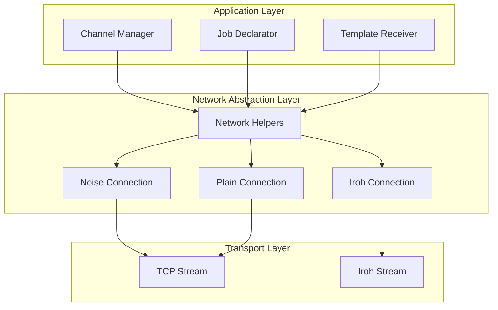

# Design Document

## Overview

This design integrates Iroh peer-to-peer networking as an alternative transport layer for Stratum V2 connections. The integration follows the existing network abstraction patterns in the codebase, adding Iroh support alongside TCP while maintaining full compatibility with existing channel management logic.

The design leverages Iroh's built-in NAT traversal, content-addressed networking, and peer discovery capabilities to enable mining connections in environments where direct TCP connections are not feasible. Based on Iroh's protocol examples and the iroh-roq implementation (https://github.com/n0-computer/iroh-roq), we'll use a hybrid approach:

1. **RPC Pattern**: For control messages (job assignments, channel setup, status updates) using Iroh's RPC-style bidirectional communication
2. **Streaming Pattern**: For high-frequency data flows (share submissions, new work notifications) using Iroh's efficient streaming capabilities similar to iroh-roq's approach for handling large data volumes

This dual approach optimizes for both the request-response semantics needed for Stratum V2 control flow and the high-throughput requirements of mining data streams.

The integration is implemented as an optional feature that extends the existing network-helpers abstraction layer.

## Architecture

### High-Level Architecture



### Integration Points

The Iroh integration extends the existing network-helpers crate with new connection types that implement the same interfaces as TCP-based connections. This ensures that higher-level channel management code remains unchanged.

Key integration points:
- **network-helpers crate**: Add `iroh_connection.rs` and `iroh_stream.rs` modules
- **channels-sv2 crate**: No direct changes needed - uses network-helpers abstractions
- **Configuration**: Extend existing config structures to support Iroh transport options
- **Feature flags**: Add `iroh` feature to make integration optional

## Components and Interfaces

### IrohStream Component

Following Iroh's hybrid approach inspired by iroh-roq for high-throughput data streaming:

```rust
pub struct IrohStream<Message> {
    // Control channel for RPC-style messages (setup, status, etc.)
    rpc_client: iroh::rpc::RpcClient<StratumV2RpcProtocol>,
    // High-throughput streaming for mining data
    data_stream: iroh::stream::BiStream,
    reader: IrohReadHalf<Message>,
    writer: IrohWriteHalf<Message>,
}

impl<Message> IrohStream<Message> 
where 
    Message: Serialize + Deserialize<'static> + GetSize + Send + 'static,
{
    pub async fn new(
        node: &iroh::Node,
        peer_id: iroh::NodeId,
        alpn: &[u8],
    ) -> Result<Self, Error>;
    
    pub fn into_split(self) -> (IrohReadHalf<Message>, IrohWriteHalf<Message>);
}

// RPC protocol for control messages
pub struct StratumV2RpcProtocol;

impl iroh::protocol::Protocol for StratumV2RpcProtocol {
    type Request = ControlMessage;
    type Response = ControlResponse;
}

// Streaming protocol for high-frequency mining data
pub struct StratumV2StreamProtocol;

impl iroh::protocol::Protocol for StratumV2StreamProtocol {
    type Request = MiningDataFrame;
    type Response = ();
}
```

### IrohConnection Component

Using Iroh's dual-channel approach inspired by iroh-roq for optimal mining data flow:

```rust
pub struct IrohConnection {
    // Unified receiver for both control and data messages
    receiver: Receiver<StandardEitherFrame<Message>>,
    // Separate senders for different message types
    control_sender: Sender<ControlMessage>,
    data_sender: Sender<MiningDataFrame>,
}

impl IrohConnection {
    pub async fn new<Message>(
        node: &iroh::Node,
        peer_id: iroh::NodeId,
        alpn: &[u8],
    ) -> Result<(
        Receiver<StandardEitherFrame<Message>>,
        Sender<StandardEitherFrame<Message>>,
    ), Error>;
}

// Handler for RPC-style control messages
pub struct StratumV2RpcHandler {
    control_sender: Sender<ControlMessage>,
}

impl iroh::protocol::Handler for StratumV2RpcHandler {
    type Protocol = StratumV2RpcProtocol;
    
    async fn handle(&self, request: ControlMessage) -> Result<ControlResponse, Error> {
        // Handle channel setup, status queries, etc.
        match request {
            ControlMessage::SetupChannel(setup) => {
                // Process channel setup
                Ok(ControlResponse::ChannelSetup(response))
            }
            // ... other control messages
        }
    }
}

// Handler for high-throughput mining data streams
pub struct StratumV2StreamHandler {
    data_sender: Sender<MiningDataFrame>,
}

impl iroh::protocol::Handler for StratumV2StreamHandler {
    type Protocol = StratumV2StreamProtocol;
    
    async fn handle(&self, data: MiningDataFrame) -> Result<(), Error> {
        // Forward mining data (shares, jobs, etc.) with minimal processing
        self.data_sender.send(data).await?;
        Ok(())
    }
}
```

### Configuration Extensions

```rust
#[derive(Debug, Clone)]
pub enum TransportConfig {
    Tcp {
        address: String,
    },
    #[cfg(feature = "iroh")]
    Iroh {
        node_config: IrohNodeConfig,
        peer_id: Option<iroh::NodeId>,
        alpn: Vec<u8>,
    },
    #[cfg(feature = "iroh")]
    Dual {
        tcp: String,
        iroh: IrohNodeConfig,
        alpn: Vec<u8>,
    },
}

#[cfg(feature = "iroh")]
#[derive(Debug, Clone)]
pub struct IrohNodeConfig {
    pub storage_path: Option<PathBuf>,
    pub relay_servers: Vec<String>,
    pub stun_servers: Vec<String>,
    pub bind_port: Option<u16>,
}
```

### Unified Connection Interface

All connection types implement a common trait to ensure consistent behavior:

```rust
pub trait NetworkConnection<Message> {
    type ReadHalf: AsyncRead + Send + 'static;
    type WriteHalf: AsyncWrite + Send + 'static;
    
    async fn establish(config: &TransportConfig) -> Result<Self, Error>;
    fn into_split(self) -> (Self::ReadHalf, Self::WriteHalf);
}
```

## Data Models

### Iroh Node Management

```rust
pub struct IrohNodeManager {
    node: Arc<iroh::Node>,
    config: IrohNodeConfig,
}

impl IrohNodeManager {
    pub async fn new(config: IrohNodeConfig) -> Result<Self, Error>;
    pub fn node(&self) -> &iroh::Node;
    pub fn node_id(&self) -> iroh::NodeId;
    pub async fn listen(&self, alpn: &[u8]) -> Result<IrohListener, Error>;
    pub async fn connect(&self, peer_id: iroh::NodeId, alpn: &[u8]) -> Result<IrohStream, Error>;
}
```

### Connection Metadata

```rust
#[derive(Debug, Clone)]
pub struct ConnectionInfo {
    pub transport: TransportType,
    pub peer_info: PeerInfo,
    pub established_at: std::time::Instant,
}

#[derive(Debug, Clone)]
pub enum TransportType {
    Tcp { remote_addr: SocketAddr },
    #[cfg(feature = "iroh")]
    Iroh { peer_id: iroh::NodeId, relay_url: Option<String> },
}

#[derive(Debug, Clone)]
pub enum PeerInfo {
    Tcp { addr: SocketAddr },
    #[cfg(feature = "iroh")]
    Iroh { node_id: iroh::NodeId, addrs: Vec<SocketAddr> },
}
```

## Error Handling

### Error Types

```rust
#[derive(Debug, thiserror::Error)]
pub enum IrohError {
    #[error("Iroh node initialization failed: {0}")]
    NodeInitialization(#[from] iroh::node::Error),
    
    #[error("Connection to peer {peer_id} failed: {source}")]
    ConnectionFailed {
        peer_id: iroh::NodeId,
        #[source]
        source: iroh::endpoint::ConnectError,
    },
    
    #[error("Peer discovery failed for {peer_id}: {reason}")]
    PeerDiscoveryFailed {
        peer_id: iroh::NodeId,
        reason: String,
    },
    
    #[error("Invalid configuration: {0}")]
    InvalidConfig(String),
    
    #[error("ALPN protocol mismatch: expected {expected}, got {actual}")]
    AlpnMismatch { expected: String, actual: String },
}
```

### Error Recovery Strategies

1. **Connection Failures**: Implement exponential backoff with jitter for reconnection attempts
2. **Peer Discovery Failures**: Fall back to configured relay servers and bootstrap nodes
3. **Node Initialization Failures**: Validate configuration early and provide actionable error messages
4. **Transport Fallback**: When dual transport is configured, automatically fall back to TCP if Iroh fails

## Testing Strategy

### Unit Tests

1. **IrohStream Tests**
   - Message serialization/deserialization over Iroh streams
   - Connection establishment and teardown
   - Error handling for various failure scenarios

2. **IrohConnection Tests**
   - Bidirectional message flow
   - Connection multiplexing
   - Graceful shutdown handling

3. **Configuration Tests**
   - Valid and invalid configuration parsing
   - Feature flag behavior
   - Transport selection logic

## Implementation Phases

### Phase 1: Core Iroh Integration
- Add Iroh dependencies with feature flag
- Implement basic IrohStream and IrohConnection
- Add configuration structures
- Basic unit tests

### Phase 2: Network Helpers Integration
- Extend network-helpers with Iroh support
- Implement unified connection interface
- Add error handling and logging
- Integration tests with existing components

### Phase 3: Advanced Features
- Dual transport support (TCP + Iroh simultaneously)
- Connection pooling and management

### Phase 4: Production Readiness
- Documentation and examples