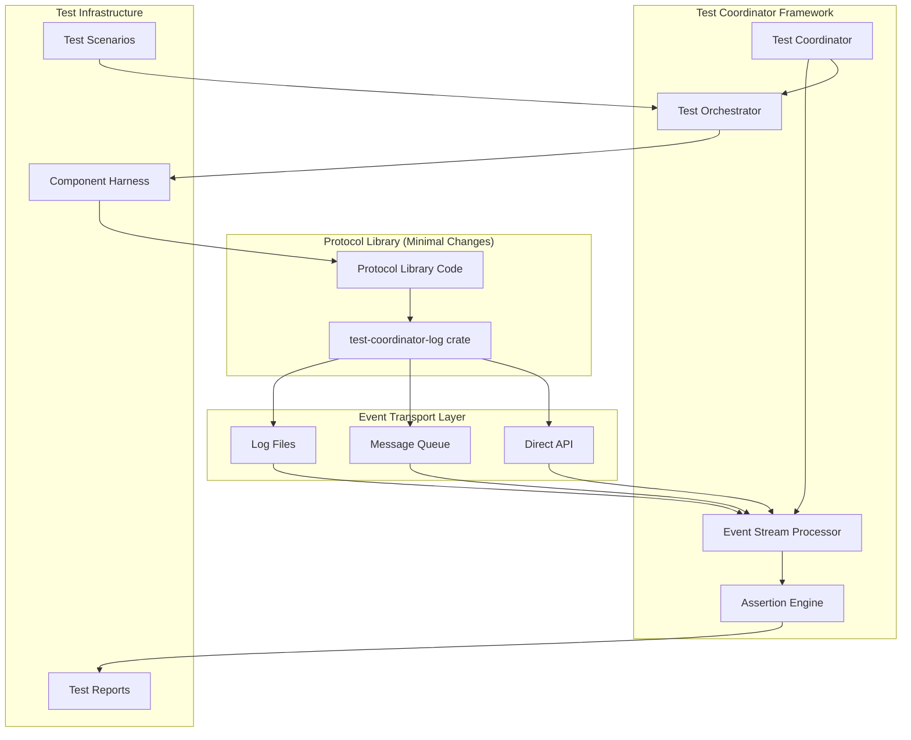

# Design Document

## Overview

The Structured Logging Framework provides a robust test coordination system for Rust protocol libraries through minimal-integration structured event logging. The framework consists of a drop-in logging replacement that automatically captures structured events and a test coordinator that orchestrates complex multi-component protocol testing scenarios.

The design emphasizes developer experience by requiring minimal code changes while providing powerful testing capabilities for distributed systems, particularly focusing on interoperability testing between different protocol implementations.

## Architecture



## Components and Interfaces

### 1. Drop-in Logging Crate (`test-coordinator-log`)

**Purpose**: Minimal-integration logging replacement that captures structured events.

**Key Features**:
- API-compatible with `tracing` and `log` crates
- Automatic structured event emission
- Zero-cost abstractions when testing disabled
- Optional event type annotations

**Interface**:
```rust
// Standard logging (unchanged)
info!("Share submitted: {}", share_id);

// Enhanced with event metadata (optional)
info!(
    event_type = "share_submitted",
    share_id = %share_id,
    channel_id = channel_id,
    "Share submitted"
);

// Structured event macro (optional)
emit_event!(ShareSubmitted {
    share_id: share_id.clone(),
    channel_id,
    timestamp: SystemTime::now(),
});
```

### 2. Event Stream Processor

**Purpose**: Converts log streams into typed events for test coordination.

**Key Features**:
- Multiple transport support (files, queues, APIs)
- Real-time event streaming
- Event ordering guarantees
- Schema validation and migration

**Interface**:
```rust
pub trait EventProcessor {
    async fn process_stream(&mut self, source: EventSource) -> Result<()>;
    fn subscribe<T: Event>(&self) -> EventReceiver<T>;
    fn validate_schema(&self, event: &dyn Event) -> Result<()>;
}
```

### 3. Test Coordinator Core

**Purpose**: Central orchestration system for multi-component testing.

**Key Features**:
- Declarative test scenario definitions
- Component lifecycle management
- Event-driven test execution
- Parallel test scenario support

**Interface**:
```rust
pub struct TestCoordinator {
    scenarios: Vec<TestScenario>,
    components: HashMap<String, ComponentHarness>,
    event_bus: EventBus,
}

impl TestCoordinator {
    pub async fn run_scenario(&mut self, name: &str) -> TestResult;
    pub fn register_component(&mut self, component: ComponentHarness);
    pub fn define_scenario(&mut self, scenario: TestScenario);
}
```

### 4. Assertion Engine

**Purpose**: Validates protocol behavior against specifications.

**Key Features**:
- Temporal assertions (timeouts, ordering)
- Custom validation plugins
- Real-time violation detection
- Detailed failure reporting

**Interface**:
```rust
pub trait AssertionEngine {
    fn assert_sequence(&self, pattern: EventPattern) -> AssertionBuilder;
    fn assert_timing(&self, event: EventType, timeout: Duration) -> AssertionBuilder;
    fn validate_protocol(&self, spec: ProtocolSpec) -> ValidationResult;
}
```

### 5. Component Harness

**Purpose**: Manages protocol component lifecycle and integration.

**Key Features**:
- Automatic component discovery
- Dependency management
- Health monitoring
- State synchronization

**Interface**:
```rust
pub trait ComponentHarness {
    async fn start(&mut self) -> Result<()>;
    async fn stop(&mut self) -> Result<()>;
    fn health_check(&self) -> HealthStatus;
    fn emit_event(&self, event: Box<dyn Event>);
}
```

## Data Models

### Event Types

```rust
// Base event trait
pub trait Event: Send + Sync + Clone + Debug {
    fn event_type() -> &'static str;
    fn timestamp(&self) -> SystemTime;
    fn component_id(&self) -> &str;
}

// Protocol-specific events
#[derive(Debug, Clone, Serialize, Deserialize)]
pub struct ShareSubmitted {
    pub share_id: String,
    pub channel_id: u32,
    pub timestamp: SystemTime,
    pub component_id: String,
}

#[derive(Debug, Clone, Serialize, Deserialize)]
pub struct ConnectionEstablished {
    pub peer_id: String,
    pub protocol_version: String,
    pub timestamp: SystemTime,
    pub component_id: String,
}
```

### Test Scenario Definition

```rust
#[derive(Debug, Clone, Deserialize)]
pub struct TestScenario {
    pub name: String,
    pub description: String,
    pub components: Vec<ComponentSpec>,
    pub assertions: Vec<Assertion>,
    pub timeout: Duration,
    pub setup: Option<SetupScript>,
    pub cleanup: Option<CleanupScript>,
}

#[derive(Debug, Clone, Deserialize)]
pub struct ComponentSpec {
    pub name: String,
    pub component_type: String,
    pub config: HashMap<String, Value>,
    pub dependencies: Vec<String>,
}

#[derive(Debug, Clone, Deserialize)]
pub struct Assertion {
    pub name: String,
    pub assertion_type: AssertionType,
    pub pattern: EventPattern,
    pub timeout: Option<Duration>,
}
```

### Event Patterns

```rust
#[derive(Debug, Clone, Deserialize)]
pub enum EventPattern {
    Single(EventMatcher),
    Sequence(Vec<EventMatcher>),
    Within { events: Vec<EventMatcher>, timeout: Duration },
    Count { event: EventMatcher, min: usize, max: Option<usize> },
    Conditional { condition: EventMatcher, then: Box<EventPattern> },
}

#[derive(Debug, Clone, Deserialize)]
pub struct EventMatcher {
    pub event_type: String,
    pub filters: HashMap<String, Value>,
    pub component: Option<String>,
}
```

## Error Handling

### Error Types

```rust
#[derive(Debug, thiserror::Error)]
pub enum TestCoordinatorError {
    #[error("Component failed to start: {component}")]
    ComponentStartupFailed { component: String },
    
    #[error("Assertion failed: {assertion} - {reason}")]
    AssertionFailed { assertion: String, reason: String },
    
    #[error("Test timeout: {scenario} exceeded {timeout:?}")]
    TestTimeout { scenario: String, timeout: Duration },
    
    #[error("Event schema validation failed: {event_type}")]
    SchemaValidationFailed { event_type: String },
    
    #[error("Protocol violation detected: {violation}")]
    ProtocolViolation { violation: String },
}
```

### Error Recovery

- **Component Failures**: Automatic restart with exponential backoff
- **Assertion Failures**: Continue test execution, collect all failures
- **Schema Errors**: Fallback to string-based parsing with warnings
- **Network Partitions**: Configurable retry policies and circuit breakers

## Testing Strategy

### Unit Testing

```rust
#[cfg(test)]
mod tests {
    use super::*;
    
    #[tokio::test]
    async fn test_event_processing() {
        let mut processor = EventProcessor::new();
        let event = ShareSubmitted {
            share_id: "test123".to_string(),
            channel_id: 1,
            timestamp: SystemTime::now(),
            component_id: "test_miner".to_string(),
        };
        
        processor.process_event(Box::new(event.clone())).await.unwrap();
        
        let received = processor.subscribe::<ShareSubmitted>()
            .recv().await.unwrap();
        assert_eq!(received.share_id, event.share_id);
    }
    
    #[test]
    fn test_assertion_builder() {
        let assertion = AssertionBuilder::new()
            .expect_sequence(vec![
                EventMatcher::new("connection_established"),
                EventMatcher::new("share_submitted"),
            ])
            .within(Duration::from_secs(30))
            .build();
            
        assert_eq!(assertion.timeout, Some(Duration::from_secs(30)));
    }
}
```

### Integration Testing

```rust
#[tokio::test]
async fn test_mining_protocol_flow() {
    let mut coordinator = TestCoordinator::new();
    
    // Register components
    coordinator.register_component(
        MinerHarness::new("test_miner", MinerConfig::default())
    );
    coordinator.register_component(
        PoolHarness::new("test_pool", PoolConfig::default())
    );
    
    // Define test scenario
    let scenario = TestScenario {
        name: "basic_mining_flow".to_string(),
        assertions: vec![
            Assertion::sequence(vec![
                "connection_established",
                "share_submitted", 
                "share_accepted"
            ]).within(Duration::from_secs(60)),
        ],
        ..Default::default()
    };
    
    let result = coordinator.run_scenario(&scenario).await;
    assert!(result.is_success());
}
```

### Performance Testing

- **Event Throughput**: Measure events/second processing capacity
- **Memory Usage**: Monitor memory consumption under high event loads
- **Latency**: Measure end-to-end event processing latency
- **Scalability**: Test with increasing numbers of components

## Implementation Phases

### Phase 1: Core Infrastructure
- Drop-in logging crate with basic event capture
- Event stream processor with file-based transport
- Basic test coordinator with simple assertions
- Component harness framework

### Phase 2: Enhanced Features
- Message queue transport support
- Advanced assertion engine with temporal logic
- Declarative test scenario definitions
- Component dependency management

### Phase 3: Advanced Capabilities
- Direct API transport for low-latency testing
- Plugin architecture for custom protocols
- Fault injection and adversarial testing
- Performance monitoring and optimization

### Phase 4: Ecosystem Integration
- CI/CD pipeline integration
- Standard report formats (JUnit, TAP)
- Documentation and examples
- Community protocol definitions

## Configuration Examples

### Minimal Integration (Cargo.toml)

```toml
[dev-dependencies]
test-coordinator-log = { version = "0.1", features = ["tracing-compat"] }

[features]
testing = ["test-coordinator-log/testing"]
```

### Test Scenario (YAML)

```yaml
name: "stratum_v2_handshake"
description: "Test Stratum v2 connection establishment"

components:
  - name: "pool"
    type: "stratum_pool"
    config:
      port: 4444
      difficulty: 1000
  - name: "miner"
    type: "stratum_miner"
    config:
      pool_url: "stratum+tcp://localhost:4444"
    depends_on: ["pool"]

assertions:
  - name: "connection_established"
    type: "sequence"
    pattern:
      - event_type: "connection_opened"
        component: "pool"
      - event_type: "handshake_completed"
        component: "miner"
    timeout: "30s"

  - name: "share_submission"
    type: "count"
    pattern:
      event_type: "share_submitted"
      component: "miner"
    min: 1
    max: 10
    timeout: "60s"
```

This design provides a comprehensive yet minimally-invasive framework for protocol testing that can be adopted incrementally by protocol library developers while providing powerful coordination capabilities for complex interoperability testing scenarios.